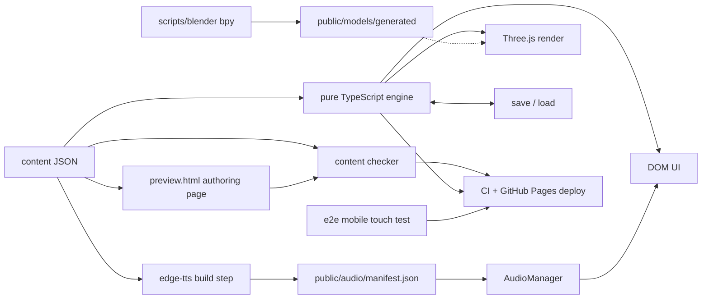

# Repository directives

## Architecture decisions
- Keep `src/engine/` pure TypeScript so gameplay stays deterministic and testable without a browser.
- Render all text in the DOM over the canvas so Mandarin remains accessible, selectable, and crisp.
- Scope slot bindings to one scene so later exchanges can reuse earlier choices without leaking state.
- Treat `Reply.correct` as authoritative and treat `Reply.check` as analytics metadata only.
- Build grey boxes first so the learning loop is validated before art receives effort.
- Generate speech at authoring time (`npm run tts`) so runtime never calls a TTS network API.
- Compose `src/render` and `src/ui` only from `src/main.ts` so neither layer depends on the other.

## Commands
- Start development with exactly `npm run dev`.
- Open the content preview at `/preview.html` on the Vite dev server (same `npm run dev`).
- Serve a production preview with exactly `npx vite preview --port 4173` (e2e default port: `4174`).
- Run unit tests with exactly `npm test`.
- Run the Pixel 7 touch e2e script with exactly `npm run e2e:mobile` (expects a preview server at `BASE_URL`, default `http://localhost:4174`).
- Check content with exactly `npm run check:content`.
- Check content strictly with exactly `npm run check:content:strict`.
- Generate speech clips with exactly `npm run tts` (dry-run: `npm run tts:dry`).
- Validate speech clips with exactly `npm run tts:validate`.
- Type-check with exactly `npx tsc --noEmit`.
- Build production output with exactly `npm run build` (GitHub Pages: `GITHUB_PAGES=1 npm run build`).
- Build optional Blender GLBs with exactly `~/.local/bin/blender --background --python scripts/blender/build_all.py -- --out public/models/generated`.

## Working rules
- Always read the nearest module README before changing a module.
- Always keep engine changes independent of browser and renderer APIs.
- Always keep user-facing setup, usage, and configuration in `README.md`.
- Always keep architecture and agent constraints in this file.
- Always keep code comments near zero and explain only why, never what.
- Always update module READMEs when files are added, removed, or repurposed.

## Forbidden patterns
- Never import DOM or Three.js APIs in `src/engine/`.
- Never import between `src/render` and `src/ui` (compose only from `src/main.ts`).
- Never draw text in WebGL.
- Never add faces to any mesh.
- Never add loans, interest, gambling, alcohol, romance, or supernatural content.
- Never write pinyin with tone numbers.
- Never pad Mandarin lines solely to satisfy coverage checks.
- Never spawn two browser workers for the same interactive check.
- Never test touch controls with mouse events; dispatch real touch (or CDP touch) only.
- Never add a runtime dependency without documenting the reason in `docs/PLAN.md`.
- Never commit changes; let the orchestrator commit.
- Never add code comments that describe what the code does.

## Generated files
- Treat `public/audio/**` and `public/audio/manifest.json` as generated by `npm run tts`; never edit by hand.
- Treat `content/phase1/word-audio-map.json` as generated/retained by the TTS inventory; do not renumber by hand.
- Treat `public/models/generated/**` as generated by the Blender build command above; never edit by hand.
- Treat `dist/` as Vite build output and never edit it by hand.
- Treat no other source files as auto-generated.
