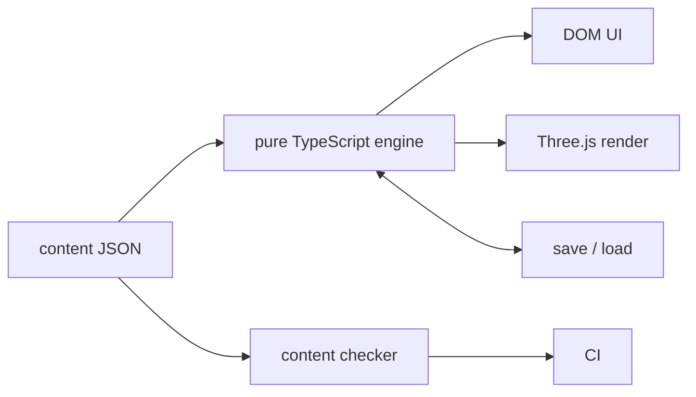

# Repository directives

## Architecture decisions
- Keep `src/engine/` pure TypeScript so gameplay stays deterministic and testable without a browser.
- Render all text in the DOM over the canvas so Mandarin remains accessible, selectable, and crisp.
- Scope slot bindings to one scene so later exchanges can reuse earlier choices without leaking state.
- Treat `Reply.correct` as authoritative and treat `Reply.check` as analytics metadata only.
- Build grey boxes first so the learning loop is validated before art receives effort.

## Commands
- Start development with exactly `npm run dev`.
- Run tests with exactly `npm test`.
- Check content with exactly `npm run check:content`.
- Type-check with exactly `npx tsc --noEmit`.
- Build production output with exactly `npm run build`.

## Working rules
- Read the nearest module README before changing a module.
- Keep engine changes independent of browser and renderer APIs.
- Keep user-facing setup, usage, and configuration in `README.md`.
- Keep architecture and agent constraints in this file.
- Keep code comments near zero and explain only why, never what.
- Update module READMEs when files are added, removed, or repurposed.

## Forbidden patterns
- Never import DOM or Three.js APIs in `src/engine/`.
- Never draw text in WebGL.
- Never add faces to any mesh.
- Never add loans, interest, gambling, alcohol, romance, or supernatural content.
- Never write pinyin with tone numbers.
- Never add a runtime dependency without documenting the reason in `docs/PLAN.md`.
- Never commit changes; let the orchestrator commit.
- Never add code comments that describe what the code does.

## Generated files
- Treat no source files as auto-generated.
- Treat `dist/` as build output and never edit it by hand.
