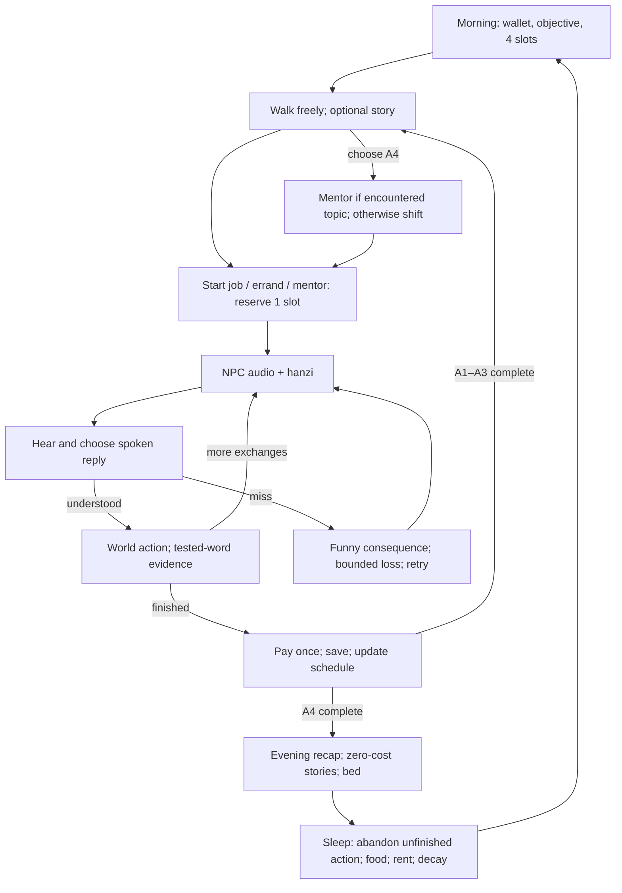

# Make It in China — Phase 1 game design

Version 1.0 · 2026-09-18 · design for WATERFALL stages 4–9. No implementation is included.

## 1. Authority, vision, and scope

Read this with [TDD.md](TDD.md), [ART.md](ART.md), and [ASSETS.csv](ASSETS.csv). `docs/WATERFALL.md` fixes camera, controls, speech, rig, audience, stack, and load ceiling; it supersedes the older fixed camera, click movement, silent slice, and 15 MB ceiling. All other owner learning, economy, theme, and validation rules in `docs/design-doc.txt` survive. Numbers below are implementation defaults, not measured playtest results.

**Fantasy:** You arrive in a fictional Chinese neighbourhood with a suitcase and twenty yuan. A landlord shows you your room and teaches you ten words. Downstairs, cups, parcels, receipts, and friendly neighbours give those words a purpose. You earn your next meal by understanding a request; a mistaken number makes an amusing pile of bowls, not a failed exam. At night a neighbour helps you make sense of what happened. A week later, the same street sounds familiar and the gate to another district represents work you can now understand.

| Item | Binding design |
|---|---|
| Audience | Adult self-learners; true beginners and HSK 1–2 returners; keyboard and touch |
| Pillars | Language is the mechanic; speech first; living street; cheap funny failure; small finished game |
| Session / phase | 15–25 minutes / 120–180 active minutes across several sittings |
| Scope | 1 district, 8 locations, 8 NPCs, 3 jobs, 25 curriculum scenes, 150 HSK 2.0 level-1 words + 碗 as 1 bonus |
| Humans | Featureless blank heads, swappable in one loader seam; no eyes, nose, mouth, face textures, portraits, or likenesses |
| Theme | Wages/trade only; no loans, interest, debt balances, investment returns, gambling, alcohol, romance, suggestive material, magic, or supernatural plots |
| Animal words | 狗 and 猫 on text labels only; no animal meshes or pictures with faces |
| Later phases | Engine phase IDs 1–4; HSK totals 150/300/600/1,200. Phase 2 tiles; Phase 3 typed pinyin; Phase 4 typed pinyin with hints off and register/connective choices |
| Later vocabulary | Bonus words explicitly marked; Phase 4 信用卡 is shop vocabulary only, never a credit mechanic |
| Exclusions | No backend, accounts, leaderboards, multiplayer, speech recognition, runtime LLM, Phase 2 content, or Bengali translation in this build |

## 2. District

Coordinates are metres: X east, Z south, Y up. Bounds X = −30…30, Z = −20…20. Level ground Y = 0. The main pedestrian street occupies Z = −4…4. Four north/south spurs join its centreline. Door coordinates below are authoritative; the diagram is schematic. All interiors are shallow ground-floor open sets with 2.4 m doorways, not separate levels. No traffic collision, jumping, stairs, or loading screens.

```text
                        NORTH (−Z)                         60 m
  −30 +------------------------------------------------------+ +30
      | ROOM           NOODLE          FRUIT        SHOP     |
      | 家             饭店             水果         商店     |
      | bed / phone    cream awning    ochre canopy  green box|
  −6  |    R                N              F           S     |
      |    |                |              |           |     |
   0  |====+================+==============+===========+====>G| 前面
      |    |          red lantern         |                  | gate
  +6  |    B                W              T                 |
      | bus board       warehouse       tea / mentor         |
      | 火车站          工作             茶                   |
      | blue bench      stacked crates  large round canopy   |
  +20 +------------------------------------------------------+
       −24             −8              +8         +22     +28
                             40 m
```

Time labels: M = morning before action 1; A1 = morning action; A2 = midday action; A3 = afternoon action; A4 = evening action; E = after action 4; S = sleep. These are state labels, not deadlines. Opening hours govern starting an activity; an ongoing exchange never expires.

| Location ID | Door X,Z; footprint centre X,Z; size X,Z | Purpose and hours | Displayed hanzi signs | Orientation cue |
|---|---|---|---|---|
| rented_room | −24,−6; −24,−11; 8,8 | Arrival, stories, bed, phone; M–E | 家; 今天; 明天 | Slate door, pale blue quilt |
| noodle_shop | −8,−6; −8,−11; 10,8 | Dishwasher, food, chats; A1–A4; S20 story also E | 饭店; 水; 茶; 米饭; 二块 | Cream awning and one red lantern |
| fruit_stall | 8,−6; 8,−9; 8,4 | Fruit purchase; A1–A3 | 水果; 苹果; 三块 | Ochre striped canopy |
| supermarket | 22,−6; 22,−11; 10,8 | Delivery desk, shop, text labels; A1–A3 | 商店; 买东西; 六块 | Sage parcel rack |
| bus_stop | −24,6; −24,9; 8,4 | Time, wrong-bus story; A1–A3 | 火车站; 前面; 后面 | Tall blue timetable; no rideable vehicle |
| warehouse | −8,6; −8,11; 10,8 | Porter; A1–A4 | 工作; 大; 小; 多少 | Three stacked crates, teal loading door |
| tea_house | 8,6; 8,11; 10,8 | Mentor and optional tea; A2–E | 茶; 请坐; 一块 | Round canopy and two benches |
| phase2_gate | 28,0; 29,0; 2,8 | Savings/word milestone; M–E | 前面; 医院 on locked side door | Two blue pillars; clinic plaque shares this frontage |

`street` in S08/S09 is a route spanning these locations, not a ninth location. S21's locked clinic door is a trigger on the gate frontage at (27,−3). NPC names/job labels may be metadata outside HSK1; instructional speech, clickable signs, phone text, menus, receipts and price tags must pass the dictionary checker. Decorative text is also dictionary-checked; no unexplained off-list shop-name textures.

Distances follow the centreline and spurs (door-to-door, no acceleration). Walk = 2.4 m/s; run = 4.0 m/s. Rounded to 0.1 s. These are route estimates, not action-slot costs.

| Trip | Metres | Walk seconds | Run seconds |
|---|---:|---:|---:|
| Room → noodle | 28 | 11.7 | 7.0 |
| Room → bus | 12 | 5.0 | 3.0 |
| Noodle → fruit | 28 | 11.7 | 7.0 |
| Fruit → shop | 26 | 10.8 | 6.5 |
| Noodle → warehouse | 12 | 5.0 | 3.0 |
| Warehouse → tea | 28 | 11.7 | 7.0 |
| Fruit → tea | 12 | 5.0 | 3.0 |
| Shop → gate | 12 | 5.0 | 3.0 |
| Room → gate | 58 | 24.2 | 14.5 |

For any remaining pair: `abs(x1−x2)+abs(z1)+abs(z2)` metres. Buildings never block this route. World perimeter uses waist-high planters/walls; the gate is visibly closed until its milestone.

## 3. Cast

All eight use the same 1.7 m humanoid rig; silhouettes vary through clothing width, hats and carried objects. Names below preserve current world IDs. Voice strings are complete edge-tts IDs; rate and pitch are generation parameters, separate from 0.8× slow playback. The player uses `zh-CN-YunxiNeural`, rate −10%, pitch +0 Hz.

| NPC ID / display name | Silhouette, main colour, identifying item | Personality | Voice / rate / pitch | Idle loop (seconds) | Owns |
|---|---|---|---|---|---|
| landlord / 王先生 | Straight coat, #526D82, navy cap and key ring | Practical and quietly generous | zh-CN-YunyangNeural / −12% / −4 Hz | 6 idle + 2 key check + 2 nod | S00,13,14,19; rent notice |
| mentor / 林老师 | Long cardigan, #8D6E63, book | Explains only what you have encountered | zh-CN-XiaoxiaoNeural / −15% / −2 Hz | 5 sit + 3 book hold + 2 look up | S04,06,17,18 |
| cook / 陈师傅 | Broad apron, #C65D3B, cream cap and towel | Brisk, patient, easily amused by stacks | zh-CN-YunjianNeural / −10% / +2 Hz | 4 idle + 3 towel gesture + 3 carry-idle | S01–03,15,20,24 |
| warehouse_boss / 赵老板 | Square vest, #455A64, clipboard | Precise about counts, relaxed about mistakes | zh-CN-YunyangNeural / −8% / −8 Hz | 4 clipboard + 2 nod + 4 idle | S05,07,23 |
| delivery_boss / 刘姐 | Narrow jacket, #5B7C4D, cross-body parcel strap | Encouraging and route-minded | zh-CN-XiaoxiaoNeural / −8% / +2 Hz | 4 carry-idle + 4 walk 4.8 m + 2 wave | S08,21; dispatches S09 |
| fruit_seller / 孙阿姨 | Rounded tunic, #B56A3D, broad straw hat | Cheerfully repeats prices | zh-CN-XiaoxiaoNeural / −12% / −6 Hz | 4 idle + 3 apple arrangement + 3 nod | S12 |
| shopkeeper / 周先生 | Narrow waistcoat, #5C6BC0, basket | Likes orderly labels and receipts | zh-CN-YunyangNeural / −10% / +1 Hz | 4 basket hold + 3 shelf gesture + 3 idle | S22; tool/top-up purchases |
| customer / 客人 | Loose coat, #7E57C2, cloth shopping bag | Curious neighbour with useful wrong turns | zh-CN-YunxiNeural / −10% / +4 Hz | 5 idle + 3 bag check + 2 wave | S09–11,16 |

| NPC | M / A1 | A2 | A3 | A4 / E |
|---|---|---|---|---|
| landlord | Room doorway | Room desk | Noodle outside | Room doorway |
| mentor | Tea bench | Tea bench | Tea doorway | Tea; day ≥5 if S18 pending: room desk |
| cook | Noodle counter | Noodle wash station | Noodle counter | Noodle counter |
| warehouse_boss | Warehouse board | Warehouse loading pad | Warehouse board | Warehouse board |
| delivery_boss | Shop dispatch | Shop dispatch | Gate clinic pad if S21 available, otherwise shop | Tea outside; review S08 starts here and routes to gate |
| fruit_seller | Fruit display | Fruit display | Fruit display | Tea bench; purchases closed |
| shopkeeper | Shop counter | Shop counter | Shop counter | Shop doorway; purchases closed |
| customer | Noodle outside; S10 pending: bus | Bus | Gate door for S09 if pending, otherwise fruit | Noodle seat |

Schedules change only after an action completes/after sleep. NPCs walk at 1.2 m/s along centreline waypoints; the objective points to their current position. Priority: active dialogue lock > pending curriculum appointment > daily schedule > idle loop. Pending S09 pins customer to gate for A1–A3; pending S10 pins customer to bus for A1–A3; no two simultaneous appointments. Mentor S18 takes priority over tea. Jobs with a moving employer use the employer's current schedule anchor for the opening, then their declared work location. Pausing freezes NPCs; hidden-tab time never advances routes.

## 4. Day and progression loop

Four total action slots per day, including an evening mentor visit. A4 is the evening opportunity, not a fifth free action. It may be a mentor or a repeat shift; the HUD recommends reserving it when a mentor topic is ready. Story scenes cost zero slots and cannot be farmed. A guided consequence costs zero additional slots. A job, errand or mentor costs one slot on entry, even if abandoned. A slot's time label remains fixed until its action completes; stories do not advance time.



Default seed for deterministic examples/tests = 1. Starting words are **unseen**; S00 teaches the starter ten. Remove the old main.ts shortcut that pre-seeds S01 requirements. Player begins with ¥20. The scene list unlock plan below is the recommended first-week route; players can sleep early, replay jobs, revisit mentors, and delay stories indefinitely. `minDay` is a lower bound on appointments, never a completion deadline. Requires-word checks still apply. Story appointments chain through previous curriculum scenes; repeat jobs do not block on later content.

| Day | Action 1 | Action 2 | Action 3 | Action 4; free stories | Start / income / purchases / end / next dawn |
|---|---|---|---|---|---|
| 1 | S01 +8 | S02 +9 | S03 +10 | S04 mentor; S00 before A1 | 20 / 27 / 0 / 47 / 45 |
| 2 | S05 +10 | S01 +8 | S02 +9 | S06 mentor | 45 / 27 / 0 / 72 / 70 |
| 3 | S07 +11 | S08 +12 | S09 +12 | S03 +10 | 70 / 45 / 0 / 115 / 113 |
| 4 | S10 + S11, fare 2 | S12 fruit 3 | S03 +10 | S17 mentor; S13–16 free before A4 | 113 / 10 / 5 / 118 / 116 |
| 5 | S05 +10 | S08 +12 | S03 +10 | S18 mentor at room; S19 then S20 free at E | 116 / 32 / 0 / 148 / 146 |
| 6 | S21 +14, tool 6 | S05 +10 | S03 +10 | S08 +12 | 146 / 46 / 6 / 186 / 164 (food 2 + rent 20) |
| 7 | S22 top-up 4 | S23 +10 | S24 +10 | Optional mentor recap | 164 / 20 / 4 / 180 / 178 |

**Worked day 1:** Arrival costs no slot or money: ¥20, 4 slots. First cups-and-bowls shift finishes at ¥28, 3 slots. Drinks shift finishes at ¥37, 2 slots. Stock shift finishes at ¥47, 1 slot. 不/没有 mentor uses the last slot with no payment. Sleep charges ¥2 once: day 2 opens with ¥45 and 4 slots. One first-shift mix-up would make all later balances ¥1 lower. There is no automatic second food bill on arrival.

**Worked day 5:** Enter with ¥116 and 4 slots from the table. Porter pays ¥10 →126/3 slots. Delivery pays ¥12 →138/2. Dishwasher pays ¥10 →148/1. Mentor visits the room for S18 →148/0. Room setup S19 and hot-day S20 are free stories; no reward. Sleep deducts ¥2 →146 on day 6. If S08 incurs one ¥2 mistake, finish at ¥146 and wake at ¥144. A second miss on that exchange adds no monetary penalty and enables assistance.

Gate predicate: at least 150 non-bonus HSK1 words have state other than unseen **and** wallet ≥¥150. Visiting the gate checks both without spending savings. On scene completion, credit the reward first, then call `settleRent`; only after that settlement may the gate check the resulting wallet, matching `src/engine/dialogue.ts`. The first planned chance is day 7 after S22 (wallet ¥160). Gate opens 1.2 m, player takes 2 steps, then sees a Phase 1 completion panel; no Phase 2 playable space. Completion is a recorded milestone; later purchases or decay do not relock it. Scene S23/S24 remain recommended optional practice, not extra gate requirements.

## 5. Systems

### 5.1 Movement, camera, and talking

| Parameter | Value / behaviour |
|---|---|
| Walk / run / carrying speed | 2.4 / 4.0 / 1.8 m/s; Shift or touch Run; no stamina |
| Acceleration / braking | 12 / 18 m/s²; release stops within 0.23 s from run |
| Turn | 540°/s shortest yaw; camera-relative movement; diagonals normalized |
| Collider | Upright capsule, height 1.7 m, radius 0.28 m; flat-ground swept circle; wall skin 0.03 m; no physics dependency |
| Obstacles | Solid walls/counters; door clearance 2.4 m; NPC soft radius 0.32 m; never trap a doorway |
| Follow camera | Perspective vertical FOV 45°; target at Y=1.0 m; 9 m target distance; 35° downward pitch; no head bob |
| Follow lag | Position decay λ=8/s; target λ=12/s; heading λ=5/s; yaw behind travel after 1.5 s without orbit |
| Orbit | Right mouse drag 0.18°/px; two-finger centroid 0.18°/px; pitch 20–55°; gamepad right stick 90°/s |
| Occlusion | Radius 0.25 m camera sweep; retract immediately to obstacle minus 0.15 m; extend λ=5/s; minimum 1.2 m |
| Framing | Player foot at 64% screen height; typical body 16–20% height; dialogue keeps both bodies in the upper phone viewport |
| E / Talk range | ≤1.8 m horizontal, line of sight, player forward dot target direction ≥0.5 (60° half-angle); exit prompt beyond 2.1 m |
| Prompt | `[E] Talk · 陈师傅`; closest valid NPC, ties by ID; touch button 56×56 CSS px |
| Start | Turn both speakers toward one another at 540°/s; freeze locomotion, keep idle/talk clips; no forced camera cut |
| Stop/pause | Escape opens pause, does not submit reply. Leave conversation is explicit; unfinished action gets no wage and keeps its spent slot |

### 5.2 Dialogue and comprehension

```text
       陈师傅                              (no portrait)
  +------------------------------------------+
  | 这 是 _杯子_ 。                          | hanzi tokens
  | [Replay] [Slow 0.8×]                      |
  | tap 杯子 → bēizi · cup    [word audio]    |
  +------------------------------------------+
  | [speaker]  杯子。                    (1) |
  | [speaker]  碗。                      (2) |
  | [Say selected reply]                     |
  +------------------------------------------+
```

On entry, start NPC audio; reveal the full hanzi on the next animation frame (≤50 ms later). No typewriter. New tokens get a 1 px dotted underline on their first exposure. Replies appear after audio ends +150 ms; Skip listening exposes them immediately but logs a skip. There is no answer timer. Hanzi stays until a reply completes.

Tapping a reply's speaker previews it without selecting or committing. Tapping its row selects it; Say commits and speaks the player's line exactly once, then the engine applies the reply after `ended` +150 ms. Keyboard 1–4 selects, Enter says; gamepad D-pad selects, A says. Preview, replay and slow replay cancel the previous speech; only one voice at a time. NPC next-line audio starts after the preceding response/consequence animation ends (animation cap 1.5 s). An audio error after 2 s displays Retry audio / Continue with text; no automatic wrong answer. Reload before reply settlement returns to the unsent exchange, never grants a second wage.

| Evidence | Word-state result |
|---|---|
| First rendered/heard line or selected reply | unseen → met; save first location, sentence and resolved audio ID |
| Correct answer that depends on an unassisted `tests` word | met → shaky → known, one step per exchange attempt; known stays known |
| Wrong answer that depends on a `tests` word | known → shaky; shaky → met; met stays met |
| Pinyin/gloss tap | Meet first if necessary, then one downward step for that tapped word only |
| Any hint/pinyin revealed for tested word in current attempt | Later correct answer gives no upward evidence for that word |
| Two misses | Authored simpler line + object gesture + highlighted matching object; next answer still required; assistance is logged |
| 3 in-game days without exposure | known → shaky only; no return to unseen; real-world elapsed days do not decay |
| Replay / slow replay | Logged, no automatic penalty; understanding with repeat listening can still count |
| Unselected reply / decorative sign / ambient chatter | No correct evidence; word only enters notebook if explicitly tapped or used in a curriculum exchange |

Delivery movement: after a correct route choice in S08 e2, S09 e2, or S21 e2, close the bubble and let the player carry the parcel to the marked gate/door trigger. The parent action remains open and its clock slot stays fixed; arrival resumes the next exchange. Walking never spends another slot, and wrong route choices first show their consequence before retry. No wage is paid until all exchanges and delivery movement finish.

Keep the four owner states exactly `unseen → met → shaky → known`; shaky is the review-priority state, not a score shown during play. Engine currently awards evidence to every word in line+selected reply: TDD specifies `tests` and assistance tracking to fix this category. Plain acknowledgements get empty `tests`; they cannot certify an entire sentence. Default pinyin setting is off; if enabled, rendering pinyin marks displayed tested words assisted once, with no repeat penalties per redraw.

### 5.3 Content and hidden repetition

| Rule | Implementation contract |
|---|---|
| Exchange size | 4–6 exchanges per curriculum scene; jobs specifically 3–5 (this plan uses 4 to 6, jobs 4 or 5); ordinary consequence vignette 1–2 |
| Novelty | At most 2 newly encountered dictionary words across NPC line + every reply + hints/branches per exchange; ~6 per scene; S00 is 10 across 5 exchanges |
| Familiarity | Target 90% familiar tokens per exchange; acceptable approximation 80–100%. Count NPC line before its exposure and replies after that line has been met; report both ratio and distinct introductions. Below80% requires rewrite; S00 bootstrap is the unavoidable zero-known tutorial exception |
| Coverage | Every one of 150 HSK1 words in ≥3 distinct reachable curriculum scenes; bonus 碗 excluded from 150; no counting repeated shifts as distinct scenes |
| Eligibility | All `requires` at least met; slot candidates already met or explicitly introduced in the current exchange; appointments have minDay/prior-scene conditions |
| Choice | 2 spoken options default; maximum 4. Wrong answers are same class/sub-theme, change a concrete outcome, and route to a consequence |
| Scripted only | No live generation at runtime. Authoring assistants may draft only against checker and native-speaker review |
| Nuance | Want/need/going-to, quantities, courtesy and measure words are long-term patterns; teach only in-level forms now. 要 and 您 are not added to Phase 1 spoken vocabulary |
| Slots | Bind on scene entry/use and retain until end; no reroll on reload/retry. Prefer shaky, then met, then introductions, then known; deterministic RNG |
| Audio | Full pre-generated sentence for each allowed slot combination; never stitch syllables at runtime |

Fixed Phase 1 slot sites: S01 e4 `cup_count`+`bowl_count` (different values), reused S01 e5 replies; S02 e4 `cup_count`; S08 e2 `place`; S23 e1 `size`, e2 `count`, e3 `place`; S24 e1 `drink`, e2 `container`, e3 `count`, e4 `negative`. No other variable sites in stage 4. Pools: numbers 一…十; place 前面/后面/里; size 大/小; drink 水/茶; container 杯子/碗; negative 有/没有. Each pool token must obey its first-introduction scene. More sites require regenerated asset inventory and audio manifest.

A current curriculum audit is required before writing full scripts: S01 e1 contains early 不, S01 consequence contains early 不/碗, S02 e2 contains early 和, and S01 e4/e5 and S02 e2/e4 have unclear or mismatched success conditions. TDD gives per-site repair decisions. Do not promote the existing checker PASS to a full-curriculum acceptance claim.

### 5.4 Economy

All money is integer yuan; wallet display `¥20`, NPC speech uses 块, written receipts use 元 only when marked as non-instructional currency notation (the instructional example uses 块). UI financial labels are English to avoid injecting off-list words.

| Income/cost | Yuan | Trigger / rule |
|---|---:|---|
| Starting wallet | 20 | Once on new game |
| Dishwasher S01 / S02 / S03 / S24 | +8 / +9 / +10 / +10 | On complete, once per run |
| Porter S05 / S07 / S23 | +10 / +11 / +10 | On complete, once per run |
| Delivery S08 / S09 / S21 | +12 / +12 / +14 | S09 paid once; S08/S21 repeatable |
| Daily food | −2 | Each sleep transition, clamped to wallet; a free plain meal fills any shortfall, no arrears |
| Weekly rent | −20 | At dawn of day 7,14,… or next completed scene with enough funds |
| Rent grace | 3 days | If short, extend repeatedly; one outstanding week only, older weeks forgiven on next due week |
| Fruit portion | −3 | S12; one purchase included in its action, optional repeat purchases use an errand slot |
| Optional tea / rice snack | −1 / −2 | Optional tea-house / noodle errand; not necessary for survival |
| Bus fare | −2 | S10 once; guided S11 detour adds no second fare |
| Phone top-up | −4 | S22 once; label-reading story proceeds with “look only” if short; buy later for same price |
| Carry strap/tool | −6 | Required for clinic delivery S21; buy atomically on starting first shift, deduct from that shift's +14 completion, no liability if abandoned |
| Regular mix-up | −1, −2, or −3 | Table below; first miss per exchange only; maximum ¥5 total per parent activity |
| Gate savings | 150 | Balance threshold, never deducted |

Zero wallet never blocks basic shifts or required learning: fruit/bus/top-up give a no-purchase dialogue variant with the same vocabulary and zero reward; unavailable purchases cannot be acquired free. Tool is employer-owned during S21, becomes player-owned only when ¥6 is withheld at first successful settlement. Abandoning returns it; no debt. Daily meals/rent cannot consume more than wallet. No penalty also consumes an action slot in this build; engine's existing optional action-penalty mode remains a compatibility rule only.

Repeatable jobs may repeat multiple times a day while slots remain; each repeat is a new paid task with new slot bindings. No money from story replay, consequence replay, ambient dialogue, import, tapping a word, or save/reload. S13 teaches the rent arrangement; **it does not charge rent** a second time. Wallet toast shows wages and deductions separately for 2 s; rent grace never presents a countdown in seconds.

Balance targets: accurate path gate day 7; struggling path median day 10, acceptable days 9–11; one day can always earn at least ¥24 from three S01 shifts, exceeding food. Browser simulation fixtures must verify the table and a novice policy (one first miss per exchange, hints thereafter, 1 extra review action/day); these are targets to measure, not a claim of proven retention.

### 5.5 Notebook and mentor

Notebook opens with Tab / book button; pauses world and speech, spends zero slots. Group by first-heard location, then first-heard order. Each row has hanzi, tone-marked pinyin, English, first sentence, word clip, sentence replay, and Bonus badge if applicable. Header `87 / 150 words met`; no due dates, flashcards, XP or exposed review queue. Unseen words occupy only the progress denominator. Current learner state can appear as neutral text in a details panel, never a competitive score. Token taps in notebook also call `tapWord`, once per explicit tap.

Mentor action = one slot; English explanation 2–3 lines after the matching experience, then the scene's Mandarin examples. S04: 不 marks refusal/habit; 没有 marks absence. S06: 几 expects a small count, 多少 asks amount/count more generally. S17: names/titles show courtesy; 您 appears only in English explanation typography, with no Mandarin audio or HSK credit. S18: reading/writing/device words applied to the player's own room. English explanations are text-only. New Mandarin words still follow ≤2/exchange. Revisit any completed mentor topic in one slot; no wages or new introductions. If A4 is skipped, offer the pending topic on later evenings without losing it.

### 5.6 Consequences: twelve authored mix-ups

Every ordinary wrong reply maps to one row below. Cost is paid once per parent exchange, maximum ¥5 per parent scene; further misses only replay the reaction. Each branch returns to the exact exchange/bindings. No red cross, buzzer, ridicule, lost unlock, or game over. Props reset after 1.5 s. Every K01–K11 line and its guided reply uses the already-taught “好。” in the current speaker/player voice; the visual action carries the correction, and the parent hint supplies specific language after two misses. First three IDs preserve existing references.

| # / scene ID | Parent sites | Visible result and repair | Exchanges / penalty |
|---|---|---|---|
| K01 p1_noodle_dishwasher_01_wrong | S00, S01 | Landlord/cook context skin: two marked trays/keys, wrong tray presented, NPC gently switches it; no unintroduced 不 | 1 / ¥1; S00 ¥0 |
| K02 p1_noodle_dishwasher_02_wrong | S02 | Water cup on tea coaster; cook swaps two coloured coasters | 2 / ¥1 |
| K03 p1_noodle_dishwasher_03_wrong | S03, S20, S24 | Empty tea pot ceremoniously poured; cup stays empty; point to water | 2 / ¥2 |
| K04 p1_mixup_size | S05, S23 e1 | Big crate on tiny marked pad; slide it to big pad | 1 / ¥1 |
| K05 p1_mixup_count | S05, S06, S23 e2 | One surplus crate wobbles on ground, never falls onto anyone | 1 / ¥2 |
| K06 p1_mixup_position | S07, S08, S23 e3 | Parcel left behind the sign; recipient appears in front of it | 1 / ¥2 |
| K07 p1_mixup_recipient | S09, S16, S17 | Bag handed across adjacent doors and returned with a wave | 1 / ¥1 |
| K08 p1_mixup_fruit | S12 | One apple on an oversized empty tray; seller adds/removes requested count | 1 / ¥1 |
| K09 p1_mixup_calendar | S13, S14 | Calendar card flipped once too far; landlord flips it back | 1 / ¥1 |
| K10 p1_mixup_home | S15, S18, S19, S22 | Book sits on wrong labelled shelf; slide to matching text label | 1 / ¥1 |
| K11 p1_mixup_clinic | S21 | Parcel placed at adjacent gate; boss points to 医院 plaque | 1 / ¥3 |
| K12 p1_wrong_bus_01 (S11) | S10 guided branch and actual route misses | Player and customer walk one loop around bus board, return to same bench; vehicles only text cards | 4 / ¥0 guided; ¥2 wrong-route |

Context skins use the parent NPC, location, known words and relevant props; shared reaction audio uses universally introduced starter words. S00 K01 line/reply = “好。” and empty tested-word set; do not introduce dish nouns early. The same visual mix-up may have parent-specific hint audio as itemized in ASSETS.csv.

S11 is guaranteed, even with perfect replies: after S10 e3, both valid routes enter it through a scripted consequence hook (TDD), then resume S10 e4. It is a curriculum scene that introduces seven transport/courtesy words; ordinary consequence branches introduce zero. This avoids requiring deliberate player failure to see all 150 words.

## 6. Curriculum and ambient street

Use exact introduction/recontextualisation groups in `content/phase1/scene-list.md`; do not replace its 150-word curriculum. This table binds location, scheduling, counts and routes. `after` means first successful completion of the named curriculum scene. S11 completion occurs within S10; otherwise rows chain in order. The exceptions enabling day-2 porter then evening quantities are explicitly shown. All regular exchanges have 2 replies; ordinary vignette exchanges have 1 guided correct reply. S11 has 2 non-penalised guided replies per exchange. No slots alter reply counts.

| Scene / full ID | Location / NPC | Kind | Exchanges | minDay / after | New HSK / bonus |
|---|---|---|---:|---|---:|
| S00 p1_arrival_00 | room / landlord | story | 5 | 1 / none | 10 / 0 |
| S01 p1_noodle_dishwasher_01 | noodle / cook | job | 5 | 1 / S00 | 5 / 1 |
| S02 p1_noodle_dishwasher_02 | noodle / cook | job | 5 | 1 / S01 | 6 / 0 |
| S03 p1_noodle_dishwasher_03 | noodle / cook | job; starter-ten fourth coverage | 5 | 1 / S02 | 6 / 0 |
| S04 p1_mentor_negatives_01 | tea / mentor | mentor | 5 | 1 / S03; A4 | 6 / 0 |
| S05 p1_warehouse_porter_01 | warehouse / warehouse_boss | job | 5 | 2 / S04 | 6 / 0 |
| S06 p1_mentor_quantities_02 | tea / mentor | mentor | 5 | 2 / S05; A4 | 6 / 0 |
| S07 p1_warehouse_porter_02 | warehouse / warehouse_boss | job | 4 | 3 / S06 | 6 / 0 |
| S08 p1_delivery_directions_01 | shop → street → gate / delivery_boss | job | 4 | 3 / S07 | 7 / 0 |
| S09 p1_delivery_names_02 | gate residential bell / customer | job, once | 4 | 3 / S08 | 7 / 0 |
| S10 p1_ask_time_01 | bus / customer | errand | 4 | 4 / S09 | 7 / 0 |
| S11 p1_wrong_bus_01 | bus / customer | consequence, curriculum | 4 | within S10 e3 | 7 / 0 |
| S12 p1_buy_fruit_01 | fruit / fruit_seller | errand | 5 | 4 / S10 and S11 | 7 / 0 |
| S13 p1_pay_rent_01 | room / landlord | story | 6 | 4 / S12 | 7 / 0 |
| S14 p1_landlord_phone_01 | room / landlord phone | story | 5 | 4 / S13 | 7 / 0 |
| S15 p1_cook_family_chat_01 | noodle / cook | story | 6 | 4 / S14 | 7 / 0 |
| S16 p1_customer_people_chat_02 | noodle / customer | story | 6 | 4 / S15 | 7 / 0 |
| S17 p1_mentor_address_03 | tea / mentor | mentor | 6 | 4 / S16; A4 | 7 / 0 |
| S18 p1_study_at_home_01 | room / mentor | mentor | 6 | 5 / S17; A4 | 7 / 0 |
| S19 p1_room_evening_01 | room / landlord | story | 6 | 5 / S18; E | 7 / 0 |
| S20 p1_weather_lunch_01 | noodle / cook | story | 6 | 5 / S19; E, recount today's lunch | 5 / 0 |
| S21 p1_clinic_delivery_03 | gate clinic / delivery_boss | job | 5 | 6 / S20 | 5 / 0 |
| S22 p1_street_labels_01 | shop / shopkeeper | errand | 5 | 7 / S21 | 5 / 0 |
| S23 p1_warehouse_review_03 | warehouse / warehouse_boss | job | 5 | 7 / S22 | 0 / 0 |
| S24 p1_noodle_review_04 | noodle / cook | job | 4 | 7 / S23 | 0 / 0 |

Coverage correction: S11 remains a consequence kind but counts among the explicitly numbered 25 curriculum scenes, because its route is guaranteed. Generic consequence scenes never count. S23 and S24 must carry the late-scene coverage assigned in the source list, not only numbers/dishes. Specifically S23 reuses 医院/怎么/怎么样/岁/再见 and 狗/猫/都/中国/饭店; S24 reuses the latter five as shelf/order labels. All introductions in a group appear in their introducing scene and next two assigned scenes, even if that needs a second short sentence within one exchange.

Coverage margin: schedule the starter ten 你/好/我/是/这/那/一/二/三/四 in S00, S01, S02, **and S03**. The remaining 140 HSK1 words keep at least three distinct curriculum scenes. Minimum planned scene-word placements are therefore `(140 × 3) + (10 × 4) = 460`, ten above the 450-placement minimum. Bonus 碗 remains outside both totals.

Ambient lines live in `content/phase1/ambient.json`, one entry per row below, and each is bound to a location. They play within 4 m if every token is already met. Once/NPC/slot, global cooldown 12 s, one voice max, suppressed during dialogue/menu; no learning or wage evidence. Display for audio duration +1 s, minimum 2 s. These are all dictionary HSK1, at most eight syllables each, not promises of availability on arrival. A word that appears in an ambient line counts as placed in every curriculum scene at that location (checker rule 4), which lets curriculum lines stay short enough to say aloud.

| Audio ID | Location | NPC | Hanzi | Pinyin | English |
|---|---|---|---|---|---|
| amb_001 | rented_room | landlord | 你好。 | Nǐ hǎo. | Hello. |
| amb_002 | rented_room | landlord | 你回家吗？ | Nǐ huí jiā ma? | Are you going home? |
| amb_003 | rented_room | landlord | 明天你来吗？ | Míngtiān nǐ lái ma? | Are you coming tomorrow? |
| amb_004 | tea_house | mentor | 请坐。 | Qǐng zuò. | Please sit. |
| amb_005 | tea_house | mentor | 你喝茶吗？ | Nǐ hē chá ma? | Do you drink tea? |
| amb_006 | tea_house | mentor | 我喜欢汉语。 | Wǒ xǐhuan Hànyǔ. | I like Chinese. |
| amb_007 | noodle_shop | cook | 有米饭，有八个碗。 | Yǒu mǐfàn, yǒu bā ge wǎn. | There is rice, and eight bowls. |
| amb_008 | noodle_shop | cook | 六个杯子在桌子上。 | Liù ge bēizi zài zhuōzi shàng. | Six cups are on the table. |
| amb_009 | noodle_shop | cook | 几个人？请坐椅子。 | Jǐ ge rén? Qǐng zuò yǐzi. | How many people? Please take a chair. |
| amb_010 | noodle_shop | customer | 你的衣服很漂亮。 | Nǐ de yīfu hěn piàoliang. | Your clothes are lovely. |
| amb_011 | noodle_shop | customer | 我爱吃米饭。 | Wǒ ài chī mǐfàn. | I love eating rice. |
| amb_012 | warehouse | warehouse_boss | 这本书，我读。 | Zhè běn shū, wǒ dú. | This book — I read it. |
| amb_013 | warehouse | warehouse_boss | 我四十岁。 | Wǒ sìshí suì. | I am forty. |
| amb_014 | supermarket | delivery_boss | 我去商店。 | Wǒ qù shāngdiàn. | I am going to the shop. |
| amb_015 | supermarket | delivery_boss | 他在前面。 | Tā zài qiánmiàn. | He is in front. |
| amb_016 | supermarket | shopkeeper | 谢谢你。 | Xièxie nǐ. | Thank you. |
| amb_017 | fruit_stall | fruit_seller | 苹果，三块。 | Píngguǒ, sān kuài. | Apples, three yuan. |
| amb_018 | fruit_stall | customer | 五分钟，飞机去北京。 | Wǔ fēnzhōng, fēijī qù Běijīng. | Five minutes — the plane leaves for Beijing. |
| amb_019 | bus_stop | customer | 现在几点？ | Xiànzài jǐ diǎn? | What time is it now? |
| amb_020 | phase2_gate | delivery_boss | 医生的衣服很漂亮。 | Yīshēng de yīfu hěn piàoliang. | The doctor's coat is lovely. |

## 7. Screens and overlays

DOM text everywhere, including projected street signs. No 3D text textures. Desktop reference 1280×720; phone reference 390×844 portrait and 844×390 landscape; minimum supported width 320 CSS px. All touch controls ≥48 px except Talk 56 px. At 200% text zoom use vertical scrolling; never clip choices. Modal sheets pause movement/speech; focus is trapped and restored on close. Desktop modal maximum width 720 px; phone 100% width with safe-area padding 16 px.

```text
DESKTOP WORLD 1280×720                      PHONE WORLD 390×844
+--------------------------------------+   +------------------------+
| Day 1  oooo  ¥20        [Book] [Menu] |   | Day1 oooo ¥20 [Book][≡]|
| Today: first shift at 饭店            |   | Today: first shift     |
|                                      |   |                        |
|         NPC [E Talk]                  |   |      NPC               |
|                player                |   |        player          |
|                                      |   |                        |
| WASD · Shift · E · Tab · Esc           |   | (joystick) [Run][Talk] |
+--------------------------------------+   +------------------------+
DESKTOP DIALOGUE                            PHONE DIALOGUE
+---------------------------+              +------------------------+
| NPC name   hanzi bubble   |              | world / name label     |
| [Replay] [0.8×]           |              | hanzi line             |
| (1) option [audio]        |              | [Replay] [0.8×]         |
| (2) option [audio] [Say]  |              | option [audio]          |
+---------------------------+              | option [audio] [Say]    |
                                           +------------------------+
```

The catalogue below supplies every remaining surface as an ASCII wireframe. `D` is a centred desktop panel; `P` is a phone full-height sheet. Both use the same reading order. There is no shop-management surface: purchases remain dialogue.

```text
TITLE / START
D +------------------------------+  P +--------------------+
  | Make It in China             |    | Make It in China   |
  | Continue | New game | Import |    | Continue / New     |
  | Settings | Credits           |    | Import / Settings  |
  +------------------------------+    | Credits            |
                                      +--------------------+
LOADING
D +------------------------------+  P +--------------------+
  |      street silhouette       |    | street silhouette  |
  | Loading 7 of 12 | Retry      |    | 7 of 12 / Retry    |
  +------------------------------+    +--------------------+
WORD HELP
D +------------------------------+  P +--------------------+
  | 杯子 | bēizi | cup            |    | 杯子 / bēizi / cup |
  | Hear word | Close            |    | Hear word | Close  |
  +------------------------------+    +--------------------+
ACTIVITY CHOICE
D +------------------------------+  P +--------------------+
  | NPC name                     |    | NPC name           |
  | First shift +8 - 1 slot      |    | Shift +8 - 1 slot  |
  | Talk/story 0 | Leave         |    | Talk | Leave       |
  +------------------------------+    +--------------------+
NOTEBOOK
D +------------------------------+  P +--------------------+
  | Locations | Words | 87/150   |    | Location selector  |
  | word rows | word detail      |    | word rows          |
  +------------------------------+    | detail             |
                                      +--------------------+
NOTEBOOK DETAIL
D +------------------------------+  P +--------------------+
  | word | Bonus | pinyin        |    | Back | word        |
  | English | first sentence     |    | pinyin / English   |
  | Hear word | Hear sentence    |    | word / sentence >  |
  +------------------------------+    +--------------------+
MENTOR
D +------------------------------+  P +--------------------+
  | Name | English explanation   |    | Name / explanation |
  | Mandarin example | Continue  |    | example / Continue |
  +------------------------------+    +--------------------+
EVENING RECAP
D +------------------------------+  P +--------------------+
  | Day 5 | earned | spent       |    | Day / earned/spent |
  | new words | Mentor | Bed     |    | words / Mentor/Bed |
  +------------------------------+    +--------------------+
SLEEP CONFIRMATION
D +------------------------------+  P +--------------------+
  | End day? | unused slots      |    | End day? / slots   |
  | Food 2 | Sleep | Back        |    | Food / Sleep/Back  |
  +------------------------------+    +--------------------+
RENT NOTICE
D +------------------------------+  P +--------------------+
  | Landlord | Rent 20 due       |    | Rent 20 due        |
  | Extra 3 days | Continue      |    | 3 days / Continue  |
  +------------------------------+    +--------------------+
GATE
D +------------------------------+  P +--------------------+
  | 150/150 words | 160/150 saved|    | words / savings    |
  | Walk through                 |    | Walk through       |
  +------------------------------+    +--------------------+
PHASE COMPLETE
D +------------------------------+  P +--------------------+
  | A street you understand      |    | A street you know  |
  | days | words | savings       |    | days/words/savings |
  | Keep playing | Export        |    | Keep | Export      |
  +------------------------------+    +--------------------+
PAUSE
D +------------------------------+  P +--------------------+
  | Resume | Controls | Settings |    | Resume / Controls  |
  | Save/export | Credits | Title|    | Settings / Save    |
  +------------------------------+    | Credits / Title    |
                                      +--------------------+
CONTROLS
D +------------------------------+  P +--------------------+
  | WASD/Shift/E/Tab/Esc         |    | Joystick/Run/Talk  |
  | 1-4 Enter | drag | Recenter  |    | Book/Menu/orbit    |
  +------------------------------+    +--------------------+
SETTINGS
D +------------------------------+  P +--------------------+
  | Master Speech SFX Music      |    | one setting / row  |
  | Text Pinyin Motion Quality   |    | scroll / Done      |
  +------------------------------+    +--------------------+
SAVE / EXPORT
D +------------------------------+  P +--------------------+
  | Saved day 5 | Copy | JSON    |    | Saved / Copy/JSON |
  | Import | Preview | Offline   |    | Import / Offline   |
  +------------------------------+    +--------------------+
IMPORT PREVIEW
D +------------------------------+  P +--------------------+
  | day | wallet | words | v     |    | save summary       |
  | Import this save | Cancel    |    | Import | Cancel    |
  +------------------------------+    +--------------------+
ERROR / RECOVERY
D +------------------------------+  P +--------------------+
  | Audio unavailable            |    | Audio unavailable  |
  | Retry | Continue with text   |    | Retry | Text       |
  +------------------------------+    +--------------------+
NEW GAME CONFIRMATION
D +------------------------------+  P +--------------------+
  | Replace current local game?  |    | Replace game?      |
  | Export first | New | Cancel  |    | Export/New/Cancel  |
  +------------------------------+    +--------------------+
CREDITS
D +------------------------------+  P +--------------------+
  | asset | author | licence     |    | scrollable credits |
  | font/voice notices | Close   |    | notices | Close    |
  +------------------------------+    +--------------------+
```

Title Start unlocks audio. Loading blocks interaction until required speech and scene data are ready. Word Help anchors near its token on desktop and above the reply sheet on phone, never beneath the finger. Phone activity rows are full width. Notebook audio controls are at least 48 px; Back restores the prior row. Mentor English folds above examples. Recap values are live, not the illustrated constants. Sleep adds `Unfinished shift earns 0` during an active conversation. Rent is a dismissible nonblocking due-day sheet with no debt counter. Locked Gate states both deficits and the next appointment. Phase Complete omits any Phase 2 button. Phone Pause has no background touch passthrough. Controls use labelled controller buttons. Settings scrolls one row at a time. Save/export uses native select/copy fallback and reports offline bytes/progress/retry. Import replaces only after validation and explicit confirmation while retaining a backup. Error/recovery also offers Export now for save failures and Import/New game for corrupt saves while preserving the original. Merely opening Title or New Game never erases progress. Credits use scrollable local links; fonts are never fetched remotely.

Settings defaults: master 80%, speech 100%, SFX 45%, music 18%; sliders 0–100 in steps of 5. Text size 100/125/150% (default 100%; browser zoom remains supported). Pinyin off, reduced motion follows OS, quality Auto with Low/High overrides, subtitles always on. Pause mutes ambient/music with 100 ms fade and pauses speech. Returning requires explicit resume. No answer timeouts and no loss for backgrounding the app.

## 8. First three minutes

Times are target elapsed seconds, never forced deadlines. Pauses/slow reading extend tutorial safely. S00 has 5 exchanges, 2 words each; objects and gestures teach meaning. Two replies/exchange use only words already present in that exchange. Guided mismatches cost ¥0 and cannot mark words known without independent tested-word evidence. The English instruction is outside Mandarin vocabulary scoring.

| Seconds | Beat / teaching | Exact new words / action |
|---|---|---|
| 0–10 | Title → Start; audio unlock; camera settles outside room | Wallet ¥20; no starter-word seeding |
| 10–25 | `WASD to walk` / touch joystick; walk 2 m to landlord | Movement gate succeeds at 1.5 m displacement; no timer failure |
| 25–40 | `[E] Talk`; landlord waves; S00 e1 “你好。” | 你, 好; reply “你好。”; tap one underlined token for gloss |
| 40–60 | e2 landlord points to self then player: “是我。是你。” | 我, 是; replies “我。” / “你。”; indicate requested actor with pointing |
| 60–80 | e3 point near/far key trays: “这。那。” | 这, 那; reply “这。” / “那。”; correct depends on visible pointed tray |
| 80–105 | e4 landlord counts room keys: “一。二。” | 一, 二; hear replay, then choose shown two-key tray with “二。” |
| 105–130 | e5 count four key hooks: “三。四。” | 三, 四; slow replay 0.8× once; select “四。” |
| 130–145 | S00 done; notebook opens with all ten, first sentences/audio | Tab/Book opens/closes; no action spent |
| 145–165 | Objective points to cream awning; show Run once; 28 m route | Hold Shift / Run; optional orbit tooltip, no mandatory camera gesture |
| 165–180 | Talk to cook; inspect shift card ¥8, 1 slot; start S01 e1 | First paid action; handoff into full spoken scene |

S00 e2 “是我。是你。” means “It is me. It is you.” Landlord points to self then player; only 你/我/是 occur. e2 tested words = 我/你. A mistaken response creates a harmless mirrored wave. Dialogue audio includes the exact displayed text; gestures never substitute an unlisted spoken word.

## 9. Accessibility and localisation

English glosses/explanations now; all interface copy uses stable message IDs and a separate English message dictionary. Reserve Bengali message IDs and font path without bundling untranslated placeholders. No concatenated English strings; use named variables and plural rules. Hanzi stays Simplified Chinese; pinyin uses tone marks everywhere, never tone numbers. `lang=zh-Hans`, `lang=en`, and future `lang=bn` on appropriate DOM spans.

Text contrast ≥4.5:1; focus outline 3 px; information never colour-only. Keyboard can reach every dialogue/menu control. Screen-reader text includes speaker and full line; do not announce every token separately or speak over TTS automatically. Provide optional screen-reader mode disabling NPC auto-audio while preserving manual replay. Large text and portrait have internal sheet scrolling. Reduced motion removes camera heading recenter animation, wallet bounce and decorative idle sway; dialogue/collision still work. No flashes, facial cues, timing tests, audio-only mandatory answers, or forced run.

## 10. Validation and playtest

Instrumentation is local-only, exported inside save; no analytics service or accounts. Logs record scene start/end/abandonment, exchange duration, replies, previews/replays/slow replays, pinyin taps, hint use, active play time, economic transactions, gate and import/migration. TDD bounds log size and retains aggregate totals so trimming cannot corrupt metrics.

| Question | Exact test / threshold from owner spec |
|---|---|
| Finish without pushing? | ≥60% of 5–10 validation testers reach gate within 14 days, unsupervised on own devices |
| Retain vocabulary? | 30-word recognition check 3–5 days after finish; true beginners ≥70% (≥21/30) |
| Compare with drilling? | Equal-active-time flashcard comparison; game score within 15 percentage points, and listening score higher |
| Want more? | More than 50% spontaneously express wanting more before prompted follow-up; also ask “Would you play Phase 2?” |
| No drag? | No scene loses >20% of entrants; per-scene drop-off, replay count, pinyin taps and exchange time reported |
| Pace | Accurate players about 7 in-game days; struggling players about 10; whole phase 2–3 hours |
| Stop signal | If listening, contextual recall and voluntary return do not beat drill experience, stop Phase 2 and revise Phase 1 |

Stage-5/6 vertical-slice test: 3–5 people, independently complete arrival + S01; ask only “Earn your first wage.” Record if they move, find E/Talk, hear speech, use replay, understand resulting props, and can explain one mistaken outcome. If 2 of 3 call it a quiz or need facilitator explanation, change interaction presentation before stage 8 art.

Stage-9 script: recruit 8 people (4 true beginners, 4 HSK1–2), balanced keyboard/touch. Give only the title link and “Try living on this street”; no reminders for 14 days. Ask for export at end, preserving opt-in privacy. At finish ask neutral “What would you do next?” before Phase 2 question. At day +4 use 15 audio→meaning and 15 hanzi→meaning items, no pinyin, chosen deterministically from the 150 with seed 17, stratified 10 early/10 middle/10 late introductions; no answer feedback until end. Use same item set and matched active minutes in a separate 8-person drill comparison, report beginners separately. Small samples are directional; publish numerator/denominator, not inferred significance. Owner confirms thresholds before recruitment.

## Owner decisions needed

These are sign-off/ownership items, not unresolved implementation branches. Defaults apply to private test preparation; no implementation, publication, migration of live data, or asset purchase is authorised by this document.

| ID | Owner decision needed | Recommended default | Needed by |
|---|---|---|---|
| OD1 | Accept stages 1–3 design package and its explicit engine/content corrections | Approve this Phase 1 design; preserve WATERFALL fixed decisions | Before stage 4 build |
| OD2 | Name Mandarin voice/content reviewer | Owner appoints 1 native Mandarin speaker; review all introductions and 一/不 variants, then 20% of other clips | Stage 4 sign-off |
| OD3 | Confirm validation bars and tester recruitment | Keep 60%, 70%, 15-point, majority, 20% bars; 8 game testers and 8 matched drill testers | Before stage 9 |
| OD4 | Confirm release intent and voice redistribution clearance | Private free test; owner checks service/voice distribution terms before any public release | Before external distribution |
| OD5 | Confirm remaining identity defaults from PLAN | Working title unchanged; generic fictional city; fixed outfit; no stated origin/backstory; no animal characters | Before stage 8 lock |
