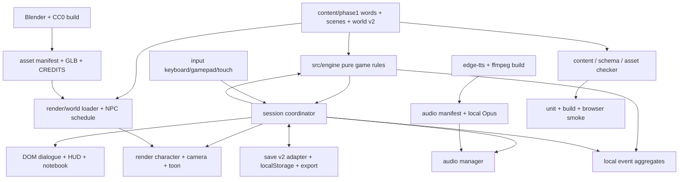
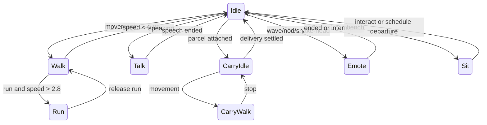

# Make It in China — Phase 1 technical design

Version 1.0 · 2026-09-18. Design only. Proposed files, APIs and commands are implementation instructions; none have been created or executed by this design. Gameplay values are authoritative in [GDD.md](GDD.md); visuals/audio in [ART.md](ART.md); inventory in [ASSETS.csv](ASSETS.csv).

## 1. Architecture and implementation boundary

Static Vite + TypeScript + three.js + DOM, local saves, no runtime network service. Keep `src/engine` pure and deterministic. Keep current dictionary, scene IDs, word-state names, scene-scoped binding model, authoritative `Reply.correct`, and opaque analytics-only `Reply.check`. World movement runs in real seconds; learning/economy only advances through commands and day transitions.



The reference [Cloudkeep repository](https://github.com/0xmariowu/cloudkeep) demonstrates a compact game with Blender asset generation, DOM controls, chase-camera occlusion, a unified input module, LOD scenery and Web Audio. Adopt those boundaries, not its flying simulation, creatures or art. Our characters require shared skeletal clips; Mandarin is pre-generated. The reference video is not evidence that our performance budget is met.

| File/module | Responsibility and disposition |
|---|---|
| src/main.ts | Boot/load, first gesture and error boundary only; replace current job-only UI scheduling and starter-word seeding |
| src/session.ts (new) | Coordinate game commands, pending spoken reply, render intent, pause, scene activity context, atomic save snapshots |
| src/content/types.ts | Add scene metadata/typed world v2/line evidence fields below; preserve current public names |
| src/content/validate.ts (new) | Browser structural validator and source-of-truth ID indexes; no silent casts from JSON |
| src/engine/{store,dialogue,economy,learner,slots,save,types,index}.ts | Extend exact seams below; no renderer/input/storage/audio imports |
| src/render/scene.ts | Renderer/lights/RAF loop; remove fixed camera and automatic talk-on-arrival |
| src/render/world.ts | Instantiate GLBs/colliders/anchors/triggers from world v2; dispose ownership |
| src/render/navigation.ts | Replace click/grid motion with swept-capsule movement plus waypoint graph for NPCs |
| src/render/input.ts (new) | Device events → one intent; input ownership, touch IDs, gamepad polling |
| src/render/camera.ts (new) | Orbit, exponential follow and sphere-sweep occlusion; no game-state mutation |
| src/render/character.ts | Shared rig, animation state machine, swappable blank head, attachments |
| src/render/npc.ts | Pure schedule target queries + deterministic waypoint following and interaction candidates |
| src/render/assets.ts | Manifest loader, SkeletonUtils cloning, reference counts, verified fallbacks |
| src/render/toon.ts | Palette remap, gradient toon material, static/skinned inverted hull; no toggle-only styling |
| src/audio/manager.ts (new) | Unlock, speech queue, preview/slow playback, routing, ducking, bounded cache |
| src/audio/procedural.ts (new) | Seeded SFX/music synthesis; no new dependency |
| src/ui/{bubble,hud,notebook,index}.ts | Current surfaces retain names; add separate select/preview/commit, all scene kinds, real objective |
| src/ui/{menus,settings,save-panel,signs}.ts (new) | DOM sheets, persisted settings, import preview, projected DOM signage |
| src/storage.ts (new) | Envelope validation, legacy-key read, backup, quota handling, export/import |
| src/telemetry.ts (new) | Local-only bounded detail log + unbounded-in-session finite aggregate counters |
| public/sw.js (new, later build) | Same-origin offline cache of revisioned shell and selected phase assets |
| scripts/tts.mjs; scripts/blender/*.py (future) | Build-time production of speech/GLBs; outlines only in this package |
| scripts/check-level.mjs | Preserve 7 existing checks; strengthen content/reachability/audio/assets rules below |
| tests/engine/*; tests/browser/*.spec.ts | Deterministic engine fixtures plus real DOM/WebGL smoke |

New files require updating their nearest README during implementation. No runtime package beyond existing three.js. Dev tooling additions: Playwright, glTF Transform CLI, fonttools; Python edge-tts/Blender and ffmpeg are build tools, not shipped dependencies. Record chosen locked tool versions in the build manifest; test against repo three.js 0.180.x, Node 20.20.2 baseline, existing lockfile. Do not silently upgrade packages while building this design.

### 1.1 Exact engine/API changes

Current exposed methods: `createGame`, `start`, `reply`, `tapWord`, `sleep`, `availableScenes`, `state`, `events`, `gloss`, `on`, `exportString`, `importString`, `saveJSON`. Keep those names and transaction rollback semantics. Current options defaults (wallet 20, slots 4, food 2, rent 20, grace 3, decay 3, penalty 1) match GDD.

| Seam / proposed addition | Exact semantics |
|---|---|
| Reply.audio | Already exists as optional; make required in stage-4 content validator, retain optional only when decoding v1 |
| Reply.id (new string) | Stable `<exchangeId>_r1` through `_r4`, never array-index-based audio paths after reorder |
| Exchange.introduces (new WordId array) | Exact per-exchange introduction list from scene-list.md; subset of Scene.introduces; pool candidates may use unseen words only if listed here, never merely later in the scene |
| Exchange.tests (new WordId array) | Tested lexical meaning only; may be empty. Slot placeholders resolve to bound word IDs; no evidence to untested filler |
| Exchange.hint (new Line) | Required if any reply can be wrong; simpler authored Mandarin + audio; no new words; shown after second miss |
| Exchange.taskAfterCorrect (new object) | `{taskId,targetTriggerId,propId}` on S08 e2 (gate_delivery), S09 e2 (residential_delivery), S21 e2 (clinic_delivery); creates durable pendingWorldTask before next exchange |
| completeWorldTask(taskId) (new command) | Renderer verifies arrival then calls once; clears pending task and presents next exchange, no second evidence/charge; rejects wrong ID and duplicate calls |
| Exchange.guidedConsequence (new scene ID) | After a correct reply, enter this consequence once then resume next exchange; no penalty, no second action. Only S10 e3 → S11 in Phase 1 |
| Scene.curriculumIndex | Integer 0…24 for these 25 scenes only; undefined for K01–K11 |
| Scene.minDay / afterScenes / allowedSlots | Positive integer; array of successful-completion IDs; subset of M,A1,A2,A3,A4,E. Validated by `availableScenes` and `start` |
| Scene.repeatable | Boolean; true only S01–03,05,07,08,21,23,24 and completed mentor revisits. S09 remains one paid completion |
| Scene.purchase | Optional `{itemId,price,mode}`; mode `optional-entry` or `withhold-first-reward`; IDs fruit_portion,bus_ticket,phone_topup,carry_strap |
| start(sceneId, options?) | options.purchase = buy/look, default buy; optional-entry with insufficient funds becomes look only after UI acknowledgement; atomic charge once; no invented free item |
| reply(index) | Signature retained; reject while pendingWorldTask; tests only; wrong penalties limited to first miss/exchange and total 5/parent scene; assist flags suppress correct promotion |
| markAssisted(words, reason) (new command) | reason pinyin-default/hint/gloss; marks attempt assistance; explicit gloss/tap also lowers via tapWord once, not per render |
| abandon() (new command) | End active parent+branches and pendingWorldTask, reward 0, preserve spent slot; reset render props; no day advance |
| recordExposure(words, source) (new command) | Explicit sign/ambient tap only; validates dictionary, meets words, stores source; never awards correctness |
| state().progress (new durable structure) | completedOn, completedCount, inventory, mentorTopics, gateReachedDay, onboardingWaived; do not reconstruct from trimmed events |
| state().activity (new nullable structure) | parentSceneId, slotLabel, penaltyTotal, penalizedExchangeIds, assistedByExchange, pendingPurchase, guidedVisited; ordinary consequence `line.audio` resolves through parent NPC context voice |
| state().dialogue | Preserve exchange, attempts, bindings, newWords, pendingNext; add returnMode retry/advance for guided consequence; keep maximum branch depth 32 |
| availableScenes() | Still returns Scene[]; exclude consequences, filter completions/day/words/action budget/metadata; no distance filtering (renderer knows positions) |
| queryGate() (new pure query) | `{met,total:150,savings,target:150,open}`; returns retained milestone if already reached |
| claimGate() (new command) | Set gateReachedDay once iff requirements true after due rent settlement; never debit savings |
| sleep() | Preserve current abandon + nextDay + decay order; reset daily schedule, slots, activity, pendingWorldTask; one food bill, no duplicate rent |
| Engine events | Retain 9 names; add transaction, assisted, gate, activityEnd. All include day and monotonically increasing command sequence |

`Scene.cost` remains for ordinary branch penalties and legacy content; move purchases to `purchase` to avoid clamped free purchases. `reward` remains gross wage. Carry strap is withheld once at S21 successful settlement; inventory grant and wage/withholding are one transaction. Existing rent semantics stay: one week outstanding, new rent day rearms grace, scene completion settles affordable rent, no debt accrual.

Default `allowedSlots` is explicit: S01–03/05/07/23/24 and S08 repeat shifts A1–A4; first S08, S09, S21 A1–A3; all errands A1–A3; mentors A4; stories M–E except S19/S20 E. MinDay/afterScenes remain the GDD table. Opening-hour checks and `availableScenes` use the activity's frozen slot label, never infer time from the already-decremented budget during an exchange. Ordinary consequence kind inherits parent location/NPC/slot; S11 retains its own customer/bus identity.

Slot fix: `fillExchange` currently appends all declared exchange slot words to every reply, even absent placeholders. Preserve actual textual word-tag order by segmenting the filled text; keep bound variables in a separate `bindings` structure. Evidence and audio keys derive from actual text/dependency references, not inflated tags. Pre-scan all routes, pool eligibility and reply distinctness as today, using guaranteed earlier exposures plus the current exchange introduction list (never future exchange introductions); enumerate permitted tuples to remove the 20-random-tries false-negative case, then make one deterministic weighted pick. Prefer shaky → met → introduced → known; ties use existing LCG. Exclude identical rendered replies before selection. Existing saves retain bindings exactly.

### 1.2 Source audit: every occurrence class and design verdict

| Defect class / all current sites | Verdict / required future correction |
|---|---|
| Silent replies: all 30 regular + 5 consequence replies in existing scenes.json | Add stable reply audio IDs and generated clips; no exception for “好” |
| Audio references: all 20 current line IDs; no runtime files | Manifest build resolves static and variable lines; no browser speech synthesis |
| Premature vocabulary: S01 e1 wrong 不; S01 wrong_e1 不/碗; S02 e2 reply 和 | S01 e1 line “你工作。” with replies “我工作。” / “你工作。”; all K01–K11 neutral starter “好。”; S02 e2 use “水。茶。” / “茶。水。”; introduce 和 only S15 |
| Ambiguous task: S01 e4 好 versus 杯子; S01 e5 several valid counts | e4 explicitly two trays, confirm target cups with count options bound to distinct counts; e5 asks indicated cup tray, with visible target cue, tests count |
| Ambiguous task: S02 e2 unordered pair reversal; S02 e4 好 versus 碗 | e2 has two coaster positions shown in requested order; speech previews only, placement occurs on commit; tests 水/茶. e4 changes both options to different already-met counts, one matching bound cup_count; tests cup_count |
| Broad evidence: dialogue.answer every line/reply token; slot fill extra tags | Use Exchange.tests; aided answers do not promote; enumerate actual filled tags |
| Free repeat stories/once jobs: engine lacks completed state; UI tracks a truncated log | Durable progress map in engine; all 25 curriculum IDs audited for repeatability in GDD |
| S11 inaccessible: consequence excluded from menus; no S10 authored | Preserve exclusion, add guidedConsequence; include only curriculum-marked consequences in coverage |
| 90% / actual novelty: checker counts declared introduces, not all unseen distractors | Simulate canonical introduction order including replies, hints, branches, slot candidates |
| Early audio/pinyin source: reply.firstSeen audio optional; frame.newWords available | Resolved reply audio required; restore underlines from frame.newWords, not audio-ID comparison |
| Wallet: spend clamps every purchase; per-miss costs can repeat indefinitely | Optional purchase variant and affordability check; first-miss + ¥5 cap; preserve food clamp and rent grace |
| Presentation: main.ts auto talk on click; objective job-only; all UI notices unchecked Mandarin | Intent-driven E/Talk; all kinds and real current title; Chinese UI text must be audited or replaced with English |
| Material/text: atlas retained on props; skinned outline skipped; possible WebGL signage | Flat remap every material/LOD; skinned hull; all hanzi DOM incl. signs |
| Save loss: main.ts deletes rejected v1; UI map separate and may be missing | Preserve original, offer recovery; unify envelope with deterministic migration |
| Coverage | Current content has 3 curriculum scenes + 3 branches, not only scene 01; full 25+11 remains stage-4 work |

These are design findings, not code fixes delivered here.

## 2. World v2 and scene graph

```text
Scene
  DistrictRoot (metres, identity transform)
    Ground / Buildings / InstancedProps
    Characters
      player: root → rig → head socket / hand sockets
      eight NPC roots: rig + attached accessories
    Triggers (invisible; no render geometry)
    DebugColliders (development only)
  CameraRig → PerspectiveCamera
  HemisphereLight + DirectionalLight
DOM: projected signs / prompts / speech anchors / HUD / modal root
```

`content/phase1/world.json` retains phase, locations, npcs and slotPools; adds schemaVersion=2, bounds, assets, meshes, colliders, spawns, waypoints, schedules, triggers, signs. Arrays reference IDs; no embedded scripts. Coordinates metres, Y up, yaw radians. Mesh dimensions in source GLB are actual metres; instance scale defaults [1,1,1]. location.position remains [X,Z] for compatibility.

| Field | Validation / meaning |
|---|---|
| assets | ID → same-origin GLB and optional LOD1; each exists in asset manifest |
| meshes | Unique id, asset, position[3], yaw, scale[3]; palette role; render only |
| colliders | box `{center,half}`; boundary `{min,max}`; roomWalls `{center,size,doorSide,doorWidth,thickness,height}` expands to 5 boxes (3 full walls + 2 door jambs) |
| roomWalls | Centred local shell; doorSide north/south/east/west; no floor/roof blocking entrance; build roof hidden while inside volume |
| spawns | Player start and one safe return per location; foot Y=0; collision clearance ≥0.31 m |
| waypoints | Named X,Z, symmetric neighbour IDs; all routes use these segments; non-neighbour walking prohibited |
| schedules | NPC → slot→waypoint; appointment overrides from GDD evaluated before schedule |
| triggers | sphere radius or box half extents; action ID from enum talk,bed,gate,delivery; no eval/string code |
| signs | DOM text, world position, facing yaw, location ID, fontRole; dictionary checked; within 14 m displayed; max 16 simultaneously |
| slotPools | Existing values with hanzi/pinyin/en/words; add stable value IDs for audio variant keys |

Full valid district example follows. It is deliberately sparse decoration but includes every location, NPC schedule, collision shape, entry/return, sign, trigger, and pool required to exercise the format. Additional ART props are instances of the same schema; their inventory is exhaustive in ASSETS.csv. Mesh GLBs are proposed assets, not files already present.

```json
{
  "schemaVersion": 2,
  "phase": 1,
  "bounds": {"min": [-30,0,-20], "max": [30,8,20]},
  "assets": {
    "district_ground": {"glb":"models/v2/district_ground.glb"},
    "building_room": {"glb":"models/v2/building_room.glb","lod1":"models/v2/building_room_lod1.glb"},
    "building_noodle": {"glb":"models/v2/building_noodle.glb","lod1":"models/v2/building_noodle_lod1.glb"},
    "building_fruit": {"glb":"models/v2/building_fruit.glb","lod1":"models/v2/building_fruit_lod1.glb"},
    "building_shop": {"glb":"models/v2/building_shop.glb","lod1":"models/v2/building_shop_lod1.glb"},
    "building_bus": {"glb":"models/v2/building_bus.glb","lod1":"models/v2/building_bus_lod1.glb"},
    "building_warehouse": {"glb":"models/v2/building_warehouse.glb","lod1":"models/v2/building_warehouse_lod1.glb"},
    "building_tea": {"glb":"models/v2/building_tea.glb","lod1":"models/v2/building_tea_lod1.glb"},
    "building_gate": {"glb":"models/v2/building_gate.glb","lod1":"models/v2/building_gate_lod1.glb"}
  },
  "locations": [
    {"id":"rented_room","name":"家","position":[-24,-6],"signs":["家","今天","明天"]},
    {"id":"noodle_shop","name":"饭店","position":[-8,-6],"signs":["饭店","水","茶","米饭","二块"]},
    {"id":"fruit_stall","name":"水果","position":[8,-6],"signs":["水果","苹果","三块"]},
    {"id":"supermarket","name":"商店","position":[22,-6],"signs":["商店","买东西","六块"]},
    {"id":"bus_stop","name":"火车站","position":[-24,6],"signs":["火车站","前面","后面"]},
    {"id":"warehouse","name":"工作","position":[-8,6],"signs":["工作","大","小","多少"]},
    {"id":"tea_house","name":"茶","position":[8,6],"signs":["茶","请坐","一块"]},
    {"id":"phase2_gate","name":"前面","position":[28,0],"signs":["前面","医院"]}
  ],
  "meshes": [
    {"id":"ground","asset":"district_ground","position":[0,0,0],"yaw":0,"scale":[1,1,1],"palette":"paving"},
    {"id":"room","asset":"building_room","position":[-24,0,-11],"yaw":0,"scale":[1,1,1],"palette":"plaster"},
    {"id":"noodle","asset":"building_noodle","position":[-8,0,-11],"yaw":0,"scale":[1,1,1],"palette":"plaster"},
    {"id":"fruit","asset":"building_fruit","position":[8,0,-9],"yaw":0,"scale":[1,1,1],"palette":"ochre"},
    {"id":"shop","asset":"building_shop","position":[22,0,-11],"yaw":0,"scale":[1,1,1],"palette":"sage"},
    {"id":"bus","asset":"building_bus","position":[-24,0,9],"yaw":0,"scale":[1,1,1],"palette":"slate"},
    {"id":"warehouse","asset":"building_warehouse","position":[-8,0,11],"yaw":0,"scale":[1,1,1],"palette":"teal"},
    {"id":"tea","asset":"building_tea","position":[8,0,11],"yaw":0,"scale":[1,1,1],"palette":"wood"},
    {"id":"gate","asset":"building_gate","position":[29,0,0],"yaw":0,"scale":[1,1,1],"palette":"slate"}
  ],
  "colliders": [
    {"id":"perimeter","shape":"boundary","min":[-30,-20],"max":[30,20]},
    {"id":"room_wall","shape":"roomWalls","center":[-24,0,-11],"size":[8,8],"doorSide":"south","doorWidth":2.4,"thickness":0.3,"height":3.2},
    {"id":"noodle_wall","shape":"roomWalls","center":[-8,0,-11],"size":[10,8],"doorSide":"south","doorWidth":2.4,"thickness":0.3,"height":3.2},
    {"id":"shop_wall","shape":"roomWalls","center":[22,0,-11],"size":[10,8],"doorSide":"south","doorWidth":2.4,"thickness":0.3,"height":3.2},
    {"id":"warehouse_wall","shape":"roomWalls","center":[-8,0,11],"size":[10,8],"doorSide":"north","doorWidth":2.4,"thickness":0.3,"height":3.2},
    {"id":"tea_wall","shape":"roomWalls","center":[8,0,11],"size":[10,8],"doorSide":"north","doorWidth":2.4,"thickness":0.3,"height":3.2},
    {"id":"fruit_counter","shape":"box","center":[8,0.5,-9],"half":[3,0.5,0.5]},
    {"id":"bus_bench","shape":"box","center":[-24,0.4,10],"half":[1.5,0.4,0.4]},
    {"id":"closed_gate","shape":"box","center":[29,1.6,0],"half":[0.3,1.6,3.5],"disabledWhen":"gateReached"}
  ],
  "spawns": [
    {"id":"player_start","position":[-24,0,-5],"yaw":3.141593},
    {"id":"return_rented_room","position":[-24,0,-5],"yaw":0},
    {"id":"return_noodle_shop","position":[-8,0,-5],"yaw":0},
    {"id":"return_fruit_stall","position":[8,0,-5],"yaw":0},
    {"id":"return_supermarket","position":[22,0,-5],"yaw":0},
    {"id":"return_bus_stop","position":[-24,0,5],"yaw":0},
    {"id":"return_warehouse","position":[-8,0,5],"yaw":0},
    {"id":"return_tea_house","position":[8,0,5],"yaw":0},
    {"id":"return_phase2_gate","position":[27,0,0],"yaw":0}
  ],
  "waypoints": [
    {"id":"j_room","position":[-24,0],"neighbors":["j_noodle","room","bus"]},
    {"id":"j_noodle","position":[-8,0],"neighbors":["j_room","j_fruit","noodle","warehouse"]},
    {"id":"j_fruit","position":[8,0],"neighbors":["j_noodle","j_shop","fruit","tea"]},
    {"id":"j_shop","position":[22,0],"neighbors":["j_fruit","gate","shop","dispatch"]},
    {"id":"room","position":[-24,-6],"neighbors":["j_room","room_desk"]},
    {"id":"room_desk","position":[-24,-10],"neighbors":["room"]},
    {"id":"noodle","position":[-8,-6],"neighbors":["j_noodle","wash"]},
    {"id":"wash","position":[-8,-10],"neighbors":["noodle"]},
    {"id":"fruit","position":[8,-6],"neighbors":["j_fruit"]},
    {"id":"shop","position":[22,-6],"neighbors":["j_shop"]},
    {"id":"dispatch","position":[20,-5],"neighbors":["j_shop"]},
    {"id":"bus","position":[-24,6],"neighbors":["j_room"]},
    {"id":"warehouse","position":[-8,6],"neighbors":["j_noodle","loading"]},
    {"id":"loading","position":[-8,10],"neighbors":["warehouse"]},
    {"id":"tea","position":[8,6],"neighbors":["j_fruit","tea_bench"]},
    {"id":"tea_bench","position":[8,10],"neighbors":["tea"]},
    {"id":"gate","position":[27,0],"neighbors":["j_shop","clinic","residential"]},
    {"id":"clinic","position":[27,-3],"neighbors":["gate"]},
    {"id":"residential","position":[26,2],"neighbors":["gate"]}
  ],
  "npcs": [
    {"id":"landlord","name":"王先生","label":"Landlord","location":"rented_room","color":"#526D82","asset":"char_landlord"},
    {"id":"mentor","name":"林老师","label":"Neighbour","location":"tea_house","color":"#8D6E63","asset":"char_mentor"},
    {"id":"cook","name":"陈师傅","label":"Cook","location":"noodle_shop","color":"#C65D3B","asset":"char_cook"},
    {"id":"warehouse_boss","name":"赵老板","label":"Warehouse employer","location":"warehouse","color":"#455A64","asset":"char_warehouse_boss"},
    {"id":"delivery_boss","name":"刘姐","label":"Delivery employer","location":"supermarket","color":"#5B7C4D","asset":"char_delivery_boss"},
    {"id":"fruit_seller","name":"孙阿姨","label":"Fruit seller","location":"fruit_stall","color":"#B56A3D","asset":"char_fruit_seller"},
    {"id":"shopkeeper","name":"周先生","label":"Shopkeeper","location":"supermarket","color":"#5C6BC0","asset":"char_shopkeeper"},
    {"id":"customer","name":"客人","label":"Customer","location":"noodle_shop","color":"#7E57C2","asset":"char_customer"}
  ],
  "schedules": {
    "landlord":{"M":"room","A1":"room","A2":"room_desk","A3":"noodle","A4":"room","E":"room"},
    "mentor":{"M":"tea_bench","A1":"tea_bench","A2":"tea_bench","A3":"tea","A4":"tea","E":"tea"},
    "cook":{"M":"noodle","A1":"noodle","A2":"wash","A3":"noodle","A4":"noodle","E":"noodle"},
    "warehouse_boss":{"M":"warehouse","A1":"warehouse","A2":"loading","A3":"warehouse","A4":"warehouse","E":"warehouse"},
    "delivery_boss":{"M":"dispatch","A1":"dispatch","A2":"dispatch","A3":"dispatch","A4":"tea","E":"tea"},
    "fruit_seller":{"M":"fruit","A1":"fruit","A2":"fruit","A3":"fruit","A4":"tea_bench","E":"tea_bench"},
    "shopkeeper":{"M":"shop","A1":"shop","A2":"shop","A3":"shop","A4":"shop","E":"shop"},
    "customer":{"M":"noodle","A1":"noodle","A2":"bus","A3":"fruit","A4":"noodle","E":"noodle"}
  },
  "triggers": [
    {"id":"arrival","action":"talk","scene":"p1_arrival_00","position":[-24,0,-6],"radius":1.8},
    {"id":"bed","action":"bed","position":[-26,0,-11],"radius":1.2},
    {"id":"noodle_work","action":"talk","npc":"cook","position":[-8,0,-6],"radius":1.8},
    {"id":"fruit_buy","action":"talk","npc":"fruit_seller","position":[8,0,-6],"radius":1.8},
    {"id":"shop_buy","action":"talk","npc":"shopkeeper","position":[22,0,-6],"radius":1.8},
    {"id":"bus_story","action":"talk","npc":"customer","position":[-24,0,6],"radius":1.8},
    {"id":"warehouse_work","action":"talk","npc":"warehouse_boss","position":[-8,0,6],"radius":1.8},
    {"id":"mentor_talk","action":"talk","npc":"mentor","position":[8,0,6],"radius":1.8},
    {"id":"gate_check","action":"gate","position":[28,0,0],"radius":1.8},
    {"id":"gate_delivery","action":"delivery","position":[27,0,0],"radius":1.2},
    {"id":"residential_delivery","action":"delivery","position":[26,0,2],"radius":1.2},
    {"id":"clinic_delivery","action":"delivery","position":[27,0,-3],"radius":1.2}
  ],
  "signs": [
    {"id":"sign_room","location":"rented_room","text":"家","position":[-24,2.6,-6.8],"yaw":0,"fontRole":"shop"},
    {"id":"sign_noodle","location":"noodle_shop","text":"饭店","position":[-8,2.6,-6.8],"yaw":0,"fontRole":"shop"},
    {"id":"sign_fruit","location":"fruit_stall","text":"水果","position":[8,2.6,-7],"yaw":0,"fontRole":"shop"},
    {"id":"sign_shop","location":"supermarket","text":"商店","position":[22,2.6,-6.8],"yaw":0,"fontRole":"shop"},
    {"id":"sign_bus","location":"bus_stop","text":"火车站","position":[-24,2.2,8],"yaw":3.141593,"fontRole":"shop"},
    {"id":"sign_warehouse","location":"warehouse","text":"工作","position":[-8,2.6,6.8],"yaw":3.141593,"fontRole":"shop"},
    {"id":"sign_tea","location":"tea_house","text":"茶","position":[8,2.6,6.8],"yaw":3.141593,"fontRole":"shop"},
    {"id":"sign_gate","location":"phase2_gate","text":"前面","position":[28.5,3,0],"yaw":-1.570796,"fontRole":"shop"},
    {"id":"sign_clinic","location":"phase2_gate","text":"医院","position":[28,2.2,-3],"yaw":-1.570796,"fontRole":"label"}
  ],
  "slotPools": [
    {"id":"number_1_10","values":[
      {"id":"n01","hanzi":"一","pinyin":"yī","en":"one","words":["一"]},
      {"id":"n02","hanzi":"二","pinyin":"èr","en":"two","words":["二"]},
      {"id":"n03","hanzi":"三","pinyin":"sān","en":"three","words":["三"]},
      {"id":"n04","hanzi":"四","pinyin":"sì","en":"four","words":["四"]},
      {"id":"n05","hanzi":"五","pinyin":"wǔ","en":"five","words":["五"]},
      {"id":"n06","hanzi":"六","pinyin":"liù","en":"six","words":["六"]},
      {"id":"n07","hanzi":"七","pinyin":"qī","en":"seven","words":["七"]},
      {"id":"n08","hanzi":"八","pinyin":"bā","en":"eight","words":["八"]},
      {"id":"n09","hanzi":"九","pinyin":"jiǔ","en":"nine","words":["九"]},
      {"id":"n10","hanzi":"十","pinyin":"shí","en":"ten","words":["十"]}]},
    {"id":"place","values":[
      {"id":"front","hanzi":"前面","pinyin":"qiánmiàn","en":"in front","words":["前面"]},
      {"id":"back","hanzi":"后面","pinyin":"hòumiàn","en":"behind","words":["后面"]},
      {"id":"inside","hanzi":"里","pinyin":"lǐ","en":"inside","words":["里"]}]},
    {"id":"size","values":[
      {"id":"big","hanzi":"大","pinyin":"dà","en":"big","words":["大"]},
      {"id":"small","hanzi":"小","pinyin":"xiǎo","en":"small","words":["小"]}]},
    {"id":"drink","values":[
      {"id":"water","hanzi":"水","pinyin":"shuǐ","en":"water","words":["水"]},
      {"id":"tea","hanzi":"茶","pinyin":"chá","en":"tea","words":["茶"]}]},
    {"id":"container","values":[
      {"id":"cup","hanzi":"杯子","pinyin":"bēizi","en":"cup","words":["杯子"]},
      {"id":"bowl","hanzi":"碗","pinyin":"wǎn","en":"bowl","words":["碗"]}]},
    {"id":"negative","values":[
      {"id":"yes","hanzi":"有","pinyin":"yǒu","en":"there is","words":["有"]},
      {"id":"no","hanzi":"没有","pinyin":"méiyǒu","en":"there is not","words":["没有"]}]}
  ]
}
```

NPC asset IDs resolve through the global asset manifest, separate from `world.assets` which lists environment GLBs. Trigger positions are nominal; NPC talk triggers follow the actual NPC transform. `queryNpcSchedule(npcId, {day,slot,progress,activeNpcId})` in npc.ts returns `{waypointId,mode,locked}`; appointment rules are exactly GDD §3. Dijkstra shortest route with lexicographic tie-break; nearest free offset among [0,0], [0.7,0], [−0.7,0], [0,0.7], [0,−0.7] prevents overlapping arrivals. If all blocked, wait. After 3 s blocked, replan; never teleport visibly. At sleep fade, all NPCs may snap to morning targets. Jobs pin participants until parent activity ends.

## 3. Characters and animation

Canonical asset: Quaternius Universal Animation Library Standard rig already credited in repo. The [publisher's library](https://quaternius.com/packs/universalanimationlibrary.html) is a CC0 source; verify the downloaded archive's licence and clip names, then rename/retarget at build time. All nine humans (player+8) use identical bone names/bind pose. Do not depend on fuzzy clip-name matching at runtime. No Mixamo dependency for Phase 1; do not mix skeleton families.

Verified `public/models/character/UAL1_Standard.glb` contents: 1 skin, 1 mesh, 67 nodes. Existing canonical mappings are idle=`Idle_Loop`, walk=`Walk_Loop`, run=`Jog_Fwd_Loop`, talk=`Idle_Talking_Loop`, sit=`Sitting_Idle_Loop` with `Sitting_Enter`/`Sitting_Exit`, pickup=`PickUp_Table`, and interact=`Interact`. The file also contains the audited crouch, dance, death, driving, fixing, hit, jump, pistol, punch, push, roll, spell, sprint, swim, sword, and formal-walk families, but Phase 1 does not ship or map those unused clips. `character_prepare.py` authors the missing carry, wave, nod, and shake clips on this rig. Runtime resolves only this explicit map.

| Requirement | Value |
|---|---|
| Units / height / head | Metres / 1.7 m / 0.2833 m (1/6); head featureless, one replaceable attachment |
| Skeleton | ≤64 bones, ≤4 skin weights/vertex, uniform positive scale; bind pose validated |
| Export axes | glTF Y-up, facing local +Z, feet Y=0; Blender export handles axis conversion |
| Root motion | None; strip root X/Z translation and root yaw; foot motion clips in place |
| Mesh budgets | LOD0 3,000 triangles/body, LOD1 900; ≤3 colour materials/body; hats/props ≤600 triangles total |
| Shared resources | Geometry/clips cached; independent cloned bones + AnimationMixer per human; no shared pose mutation |
| LOD thresholds | LOD0 ≤12 m; LOD1 ≥14 m; hysteresis 2 m; player always LOD0 |
| Animation update | Near 60 Hz high / 30 Hz low; >14 m NPCs 15 Hz; animation pose does not drive gameplay |

| Canonical clip | Loop / duration | Entry/exit |
|---|---|---|
| idle | loop 2.4 s | Default; speed <0.08 m/s |
| walk | loop 1.0 s | speed 0.08…2.8 m/s; playback scaled by actual speed/2.4, clamp 0.5…1.25 |
| run | loop 0.7 s | speed >2.8 m/s; hysteresis back at 2.5 |
| talk-gesture | loop 2.0 s | Only current speaker; no lip or face motion |
| carry-idle | loop 2.4 s | Carrying and speed <0.08 |
| carry-walk | loop 1.2 s | Carrying and moving; speed max 1.8; no carry-run |
| wave | once 1.2 s | Greeting; returns previous idle; interruptible by input |
| nod | once 0.7 s | Concrete acknowledgement; not a grading icon |
| shake-head | once 0.8 s | Gentle confusion; no red/error UI |
| sit | loop 3.0 s | Bench context only; root pinned to seat marker |

All locomotion crossfades 0.18 s; idle↔talk 0.12 s; carry state change 0.20 s; emote interruption 0.10 s; sit enter/exit 0.25 s. Full-body clips only; no upper-body masking dependency. Carry/talk: keep carry-idle, add 4° torso turn from attachment rig or substitute restrained talk clip with hand sockets stable. Clip duration export resampling is 30 fps. Original source clip may be cropped/rescaled to canonical durations, never inferred at runtime. Blender-authored gestures fill any missing required clip using existing rig; asset gate fails if any is absent.



## 4. Input, motion, and camera math

Intent is a plain value produced each simulation tick, not a TypeScript implementation here:

| Field | Type / range |
|---|---|
| moveX, moveY | finite float −1…1, radial length ≤1 |
| runHeld | boolean |
| interactPressed, notebookPressed, pausePressed, confirmPressed, cancelPressed | edge booleans, consumed once |
| replyIndex | null or integer 0…3 |
| orbitYawDelta, orbitPitchDelta | radians since last tick |
| source | keyboard/gamepad/touch |
| pointerCaptured | boolean; no pointer-lock requirement |

WASD → planar move; Shift run; E interact; Tab notebook; Escape pause. Gamepad left stick radial deadzone 0.18 remapped to 0…1; right stick 0.18, 90°/s; A interact/confirm, B cancel, X notebook, Start pause, left trigger run above 0.5. Last device with nonzero input wins until another device changes, avoiding summed movement. Dialogues/modals own input; typing in import fields never moves player. Window blur, touchcancel, lost capture and controller disconnect zero every held input.

Touch joystick base diameter 112 px at left 80 px/bottom 96 px + safe inset; thumb diameter 48 px; max deflection 40 px; deadzone 8 px; remaining 32 px linear mapping. Fixed base, no floating teleport; one captured pointer. Run 48 px, Talk 56 px, Book/Menu 48 px; joystick and Run/Talk simultaneously supported. Orbit requires 2 pointers beginning outside controls, uses centroid movement, ignores pinch zoom; prevent page scroll only on game surface. In menus allow native scroll. No gesture can both orbit and submit a reply.

Fixed simulation step 1/60 s, accumulated render delta capped 0.1 s and maximum 6 substeps. Excess hidden-tab time discarded. Desired velocity = normalized input × speed, approach by acceleration×dt; braking uses 18 m/s². Rotate root by shortest yaw delta capped 540°/s×dt. Collision sweeps capsule's 2D circle against expanded AABBs; earliest hit moves to contact minus 0.03 m, slide tangent, maximum 3 iterations/tick. NPC separation pushes NPC first; player never moves from NPC overlap while typing. World boundary clamps at radius+skin. Collision prevents tunnelling at run speed and 10 fps synthetic tests.

Camera desired target = player foot + [0,1,0]. Offset for heading θ and downward pitch φ: `[−sinθ cosφ, sinφ, −cosθ cosφ] × distance`. Default distance 9 m, φ=35°. Every smoothed scalar/vector uses `a = 1 − exp(−λ·dt)` and `current += (target−current)·a`; shortest-angle interpolation for yaw. λ position=8, aim=12, yaw=5; independent of fps. FOV 45°, near 0.1 m, far 100 m, world-up [0,1,0]. Target projected to foot at 64% height using a camera view offset, not a tilted horizon.

Camera obstruction uses swept sphere radius 0.25 from target to desired eye against expanded wall/prop boxes. Allowed eye distance = nearest hit distance−0.15 m, clamp 1.2…9. Retraction immediate; extension exponential λ=5. If collision requires <1.2 m, hide the obstructing roof/wall section locally and clamp eye at 1.2; do not place camera inside wall. Capsule player clearance still applies. Interior roofs fade 1→0 in 0.15 s when player enters the room volume, restore on exit. No postprocess transparency blur. Orbit yaw free 360°, pitch 20…55°, idle recenter after 1.5 s with λ=5; reduced-motion mode keeps manual heading until explicit Recenter in controls.

Acceptance math: after 1 s stationary target step, residual position error ≤exp(−8)=0.000336 of start; 30/60/120 fps results differ <0.01 m. Ray/sphere tests cover narrow doors, backing against every building, and turning beside the gate. No clipping through camera near plane.

## 5. Rendering, lighting, palette

Use MeshToonMaterial with all source atlas maps removed; map each authored material name to ART palette. Three.js requires nearest filtering for `gradientMap`; this is documented in [MeshToonMaterial](https://threejs.org/docs/pages/MeshToonMaterial.html). Ramp is 3×1 single-channel non-colour bytes [70,165,255], Nearest min/mag, no mipmaps. Display output sRGB, tone mapping disabled, exposure 1.0. This intentionally matches the current `src/render/toon.ts` baseline.

Default outline is inverted hull, dark `0x171717`, BackSide, depth test on, no shadow casting. Extrude after skinning in view space along normalized transformed normals to approximate CSS width; desktop 1.5 px, mobile 1.0 px, cap world expansion 0.025 m. Skinned hull shares the visible mesh skeleton/bind matrices, never a second independently animated rig. Skin position AND normal before expansion. Reuse geometry, only one extra draw/material. Join coplanar material groups where possible; author welded outline normals to prevent seam cracks.

Material names map exactly to ART roles: mentor cardigan→umber `#8D6E63`; delivery jacket→olive `#5B7C4D`; fruit-seller tunic→clay `#B56A3D`; shopkeeper waistcoat→periwinkle `#5C6BC0`. Other mappings retain plaster/paving/wood/terracotta/sage/slate/ochre/teal/plum/skin roles. Unknown imported material names fail validation instead of retaining an atlas colour.

No post outline in shipping path: a normal/depth target plus fullscreen edge pass would consume extra bandwidth. Optional comparison experiment at stage 8 is capped at 2 ms on target Android and cannot become a required dependency. Low fallback retains player + active-NPC outlines only, removes distant NPC/prop hulls, uses blob shadows. Fallback never removes all silhouettes or reintroduces painted faces.

| Render feature | High (laptop) | Low (Android) |
|---|---|---|
| Pixel ratio / render scale | min(DPR,1.5) / 1.0 | min(DPR,1.0) / 1.0; fallback 0.85 |
| MSAA | antialias true | antialias false |
| Shadow | One 1024² directional PCFSoft, 24×24 m camera-follow volume | Blob shadows; no dynamic shadow map |
| Main light | directional at [−12,18,−8], intensity 2.0 | Same direction/intensity, no shadows |
| Fill | Hemisphere sky/ground, intensity 1.2 | Same |
| Shadow settings | near 0.5, far 45, bias −0.0003, normalBias 0.02 | N/A; blob alpha 0.18, radius 0.4 m |
| Rendered triangles including hulls/shadow | ≤180,000 | ≤90,000 |
| Draw calls including hulls/shadow | ≤120 | ≤70 |
| Extra screen-space passes | 0 | 0 |
| Outline cost p95 | ≤1.5 ms | ≤1.0 ms |
| Lights / particles | 2 lights; 24 steam quads | 2 lights; 8 steam quads |

Time palette transitions 1.0 s after slot ends. M/A1 morning fog is near/far 28/82 m with density fallback 0.010; A2 is 34/90 m and 0.008; A3 is 26/76 m and 0.012; A4/E is 20/66 m and 0.016. Shipping uses ART's linear near/far mode; the density values are exact FogExp2 fallback calibration and are not applied simultaneously. World colours remain unchanged except lighting/fog colours in ART. No additional point lights for lanterns: emissive 0.25 and coloured mesh only. Materials ≤32 unique district-wide. Batch static props per material/location; do not batch across interior visibility volumes. Context loss shows recovery overlay; rebuild from asset cache and engine snapshot, no day/word reset.

## 6. Audio generation and runtime

### 6.1 Build-time speech

`scripts/tts.mjs` reads words, scenes, world pools, NPC voice presets, ambient lines, and UI speech catalog. Use child_process.spawn with argument arrays, no shell interpolation. Provider calls happen only in asset-authoring work, never runtime/CI. edge-tts CLI accepts voice/rate/pitch and internally generates restricted prosody SSML; arbitrary custom SSML is unsupported. The [edge-tts documentation](https://github.com/rany2/edge-tts#custom-ssml) also requires negative values in `--rate=-10%` form. Do not send hand-written SSML or XML as spoken text.

Pipeline contract:

1. Validate full content and enumerate all line/reply/hint/ambient/notebook IDs before network calls. UTF-8 NFC, preserve Mandarin punctuation; no pinyin in spoken input.
2. Select NPC voice from GDD; all replies use player voice. Enforce more than 2 Hz separation between characters sharing a provider voice. Notebook uses Xiaoxiao at −15%, +0 Hz but is not a character. No English mentor TTS in Phase 1.
3. Expand entire sentences for each permitted slot tuple. IDs for fixed line = exchange ID; replies = `<exchange>_r1`; hints = `<exchange>_hint`. Variants = `<base>__v000` etc, zero-based, ordered by stable pool value order, slot names lexicographically sorted. S01 pair tuples exclude equal counts.
4. Hash text+voice+rate+pitch+provider-version+codec settings with SHA-256; reuse cached build output on hash match. Exact same text/prosody can share physical file via manifest aliases; CSV logical IDs remain separate.
5. Run edge-tts to intermediate MP3; timeout 30 s, concurrency 2, retry 3 times after 1/2/4 s; fail with named IDs, never silently generate empty audio.
6. Convert with ffmpeg to Opus mono in Ogg or WebM, 48 kHz, 32 kbps CBR (`libopus`, application voip); loudness target −18 LUFS integrated and true peak ≤−2 dBTP; leading/trailing silence ≤80/180 ms. Minimum word duration 0.25 s; maximum dialogue line 6 s.
7. ffprobe duration/channel/rate check; store SHA-256, bytes and durationMs. Safari 17+ and supported Chromium/Firefox decode Opus, so there is no AAC copy or compatibility reserve. Per-file `budget_kb` is duration-derived at approximately 4 KB/s: duration ≤2 s→8 KB, ≤3 s→12 KB, ≤4 s→16 KB, and ≤6 s→24 KB. The enforced byte ceiling is `ceil(base cap × 1.05)` to tolerate Opus container and encoder overhead near duration boundaries. Exceeding either duration or its tolerated cap fails authoring. No runtime speech synthesis fallback.
8. Emit revisioned `public/audio/manifest.json`, deterministic inventory delta, and review sheet text/pinyin/voice/file. Native reviewer checks all introduced words and 一/不 connected-speech variants plus 20% of remaining clips, as OD2.

Per-word audio: 151 clips (`word_001`…`word_151`) in current words.json order, plus explicit hanzi lookup in manifest. Do not rely on indexes after dictionary reorder; retain exported ID mapping. Syllable sandhi is validated on whole-line audio, not inferred from isolated word clips. Pinyin uses tone marks and context-appropriate surface reading; notebook isolated entries use dictionary pronunciation.

| Variable base site | Number of line variants | Reply variants |
|---|---:|---|
| S01 e4 cup_count + bowl_count | 90 | r1 and r2 depend on their single count: 10 each |
| S01 e5 fixed question | 1 | r1/r2 single count: 10 each |
| S02 e4 cup_count | 10 | r1 echoes count: 10; r2 fixed paired count: 10 |
| S08 e2 place | 3 | each reply echoes one bound place or deterministic wrong alternative: 3 each |
| S23 e1 size / e2 count / e3 place | 2 / 10 / 3 | 2 / 10 / 3 each reply |
| S24 e1 drink / e2 container / e3 count / e4 negative | 2 / 2 / 10 / 2 | 2 / 2 / 10 / 2 each reply |

Wrong alternatives for one-variable sites are fixed independently of learner state: numbers pair 1↔2,3↔4,5↔6,7↔8,9↔10; size/drink/container/negative swap the two values; place maps front→back, back→front, inside→front. Both the requested value and its wrong alternative must be eligible before the requested value can be selected. Thus a binding always resolves to the same spoken texts and distinct replies across saves/learners. On first introduction, all possible visible alternatives must already be met or included within that exchange's ≤2 new words. For count pools use only pairs whose members are already met; if no pair is eligible, keep the scene locked and point to its earlier prerequisite. S01 has taught 1–4 before any count selection, so this cannot block the canonical route. At S01 first pass values 1–4 are available.

Example manifest excerpt (hash shown is an illustrative 64-character digest; builder computes actual bytes):

```json
{
  "schemaVersion":1,
  "contentRevision":"phase1-design-1",
  "clips":{
    "p1_noodle_dishwasher_01_e2":{
      "url":"audio/phase1/p1_noodle_dishwasher_01_e2.opus",
      "text":"这是杯子。","voice":"zh-CN-YunjianNeural","rate":"-10%","pitch":"+2Hz",
      "durationMs":1800,"bytes":7600,"sha256":"0000000000000000000000000000000000000000000000000000000000000000"
    },
    "p1_noodle_dishwasher_01_e4__v000":{
      "url":"audio/phase1/p1_noodle_dishwasher_01_e4__v000.opus",
      "text":"二个杯子，一个碗。","voice":"zh-CN-YunjianNeural","rate":"-10%","pitch":"+2Hz",
      "durationMs":3200,"bytes":13200,"sha256":"0000000000000000000000000000000000000000000000000000000000000000"
    }
  },
  "variants":{
    "p1_noodle_dishwasher_01_e4":{
      "slots":["bowl_count","cup_count"],
      "byBinding":{"bowl_count=n01|cup_count=n02":"p1_noodle_dishwasher_01_e4__v000"}
    }
  },
  "words":{"杯子":"word_004"}
}
```

Manifest excerpt has one of 90 tuples for illustration; actual manifest must enumerate all and fail missing entries. Grammar uses 二 before 个 only where native reviewer accepts the counting context; 两 is outside Phase 1 dictionary and cannot silently appear in speech. If reviewer rejects a count phrase, use separated count confirmation (“杯子，二个。”) while keeping the same permitted vocabulary; regenerate text+audio+hash together.

### 6.2 AudioManager

API design: `unlockFromGesture()`, `playSpeech(id,{rate,role})`, `previewReply(id)`, `replay({slow})`, `playWord(id)`, `playSfx(id,position?)`, `setVolumes(values)`, `pause()`, `resume()`, `stopSpeech()`, `dispose()`. Speech methods return completed/cancelled/error plus duration; only completed or explicit text-continue can settle a pending reply. A monotonic playback token prevents an old `ended` callback committing a new exchange.

One AudioContext, one reusable HTMLAudioElement for speech connected via MediaElementAudioSourceNode to speech gain → master compressor → destination. This retains `playbackRate=0.8` with `preservesPitch=true` for Mandarin slow replay; AudioBufferSourceNode rate change alone shifts pitch and is unsuitable. [HTMLMediaElement preservesPitch](https://developer.mozilla.org/en-US/docs/Web/API/HTMLMediaElement/preservesPitch) documents pitch preservation. Safari 17+ and supported Chromium/Firefox use the checked-in Ogg/WebM Opus file directly. Feature-test pitch preservation; if absent, disable slow replay with an accessible explanation rather than shipping a second codec or pre-generated duplicate.

Unlock on Start/tap/key activation; context.resume and a silent warm-up, catch autoplay rejection. Speech priority: committed reply > NPC dialogue > requested replay/word > ambient. New foreground request cancels prior foreground; previews do not advance engine. While speech active, music gain multiplies by 0.25 (−12 dB), SFX by 0.5 (−6 dB), ambient muted; attack 80 ms, release 300 ms. End-to-start gap 150 ms. Dialogues are centred mono; ambient NPC speech uses distance attenuation beyond 2 m to zero at 8 m and optional stereo pan limited ±0.5. No overlapping ambient and teaching speech.

Cache current/next exchange clips plus 151 word URLs; limit fetched compressed LRU to 8 MB, decoded procedural buffers to 16 MB. Fetch current parent+consequence set before starting paid activity, show progress if >500 ms. Prefetch all phase audio via “Download for offline play” in pause/save sheet; show total bytes. After all assets cached, engine+speech work in airplane mode. SW cache revision switch occurs only on title/reload with validated contentRevision; never update half a dialogue. Cache failure leaves online play usable and reports offline unavailable. No external analytics/audio/font requests in gameplay.

SFX/music are original procedural recipes in ART, with IDs in CSV. `source=owner` means project-authored recipe/design; budgets include recipe or baked clip cap, not an external recording. Music is beatless pentatonic sustained tones, 60 s deterministic loop with 2 s crossfade, no vocals or cultural caricature. Speech remains intelligible at default volumes. Reduced motion does not mute necessary sound; audio sliders are independent.

## 7. Asset pipeline and budgets

Authoring stages: source archives + licence records → Blender normalize/recolour/blank-head/retarget/LOD → GLB → glTF Transform dedup/prune/weld + Meshopt → validate manifest → browser. The [glTF Transform CLI](https://gltf-transform.dev/cli) supplies optimization/compression operations; pin its installed version and check CLI help during implementation. Meshopt is the only compression format in this design. No Meshopt decoder is registered in the current runtime today; stage 5 must register a local decoder before compressed output is accepted.

Blender source scripts live in `scripts/blender/` when implemented. Five detailed outlines are ART §7; no executable Python is part of this deliverable. Batch entry `build_all.py` invokes deterministic builders (seed 17), exports metre-scale meshes and LOD pair, records Blender/tool versions. Do not overwrite owner-authored .blend files; generated .blend output is separate from source. Generated props are Chinese signboard, lantern, bamboo steamer, stall and doorway. Other tiny props use the same flat primitive construction helpers.

CC0 import rules: archive source URL, author, exact licence text, source hash, chosen subfile; reject assets without proven CC0, face geometry or disallowed themes. Flatten any facial geometry in Blender, remove texture faces, inspect head from front/side/back and both LODs. No runtime-only hide-name heuristic as proof. Fonts are separately licensed OFL, not CC0; retain their notices. Every output, including project-authored assets, gets `docs/CREDITS.md` entry (source, author, licence, transformations). Existing downloaded assets remain candidates until budget/faceless review passes; CSV status `existing-review` reflects this.

Character recipes reference shared body and skinned outfit-shell geometry; width/material changes are deterministic recipe parameters, bone lengths remain fixed. Each recipe is 5 KB metadata, not a complete human GLB. Offline geometry preparation merges clothing colour groups into the ≤3 body-material budget.

Asset manifest format: `schemaVersion`, `revision`, `entries[id]={url,type,bytes,sha256,triangles,materials,bones,clips,lod1?,bounds,sourceCreditId}`. Variant character rows may reference shared geometry bytes; record `aliasOf` and count bytes once. CSV budgets are per logical output caps, uncompressed transfer bytes in decimal KB (1 KB = 1,000 B). Runtime scripts/fonts/audio are exceptions to GLB-only geometry; no FBX/OBJ/image portrait files shipped.

| First-play load category | Maximum KB |
|---|---:|
| HTML/JS/CSS and local decoder | 1,500 |
| World content + manifests + UI strings | 500 |
| CJK/Latin/pinyin font subset + font licence | 600 |
| Shared rig/10 clips/character variants/LODs | 3,000 |
| Buildings/ground/LOD pairs | 3,500 |
| Props/UI small resources | 1,500 |
| Arrival + first shift speech + words | 1,000 |
| SFX/music recipes or rendered loops | 300 |
| Safety reserve | 3,100 |
| **Target first interactive set** | **15,000** |
| Remaining phase Opus speech | 7,000 |
| Unallocated ceiling margin | 3,000 |
| **Hard complete first-load/offline pack ceiling** | **25,000** |

All assets necessary for Phase 1 must fit 25 MB; first interactive set targets 15 MB. Opus in Ogg/WebM is the only speech payload, with no AAC or duplicate slow-playback reserve. Loader downloads required subset first, remaining clips in background with user-visible offline readiness. Network transfer checked from production assets, not source ZIP sizes. ASSETS.csv is a procurement envelope; its duration-derived speech caps are deliberately additive for this proof, while aliases still count physical bytes once at build verification. To meet budget, trim silence, share identical clip bytes, and remove unused UAL clips and duplicate meshes; do not weaken speech coverage or vocabulary requirements.

### 7.1 Complete-pack budget proof

`ASSETS.csv` has 1,040 data rows. After replacing all 138 TTS 28 KB caps and all 90 TTS 40 KB variable-line caps with the ≤6 s 24 KB cap, its `budget_kb` sum is `20,206 − (138 × 4) − (90 × 16) = 18,214 KB`. The remaining 40 KB row is the non-TTS streetlight geometry budget.

| Complete-pack component | Budget KB |
|---|---:|
| Sum of all 1,040 ASSETS.csv `budget_kb` cells | 18,214 |
| HTML/JS/CSS and local Meshopt decoder | 1,500 |
| World content, manifests, and UI strings | 500 |
| **Proved complete-pack total** | **20,214** |
| Margin below 25,000 KB hard ceiling | 4,786 |

The proof counts every CSV logical row, so aliases make it conservative. Production verification also sums unique emitted bytes and must be ≤20,214 KB for these planned caps and always ≤25,000 KB.

## 8. Save v2 and local instrumentation

Root envelope v2 is separate from old bare v1 engine string; still UTF-8 JSON encoded as base64 for copy/export. Download JSON is the decoded same envelope. Local key `make-it-in-china.save.v2`; legacy keys `make-it-in-china.save.v1` and `make-it-in-china.ui.v1` read only during migration. No deleting old keys automatically.

```json
{
  "v":2,"contentRevision":"phase1-design-1","savedAt":"2026-09-18T00:00:00.000Z",
  "engine":{
    "v":2,"wallet":20,"day":1,"actionSlots":4,"rentDue":false,"graceUntil":null,
    "rules":{"actionSlots":4,"foodCost":2,"rentCost":20,"graceDays":3,"decayDays":3,"wrongPenalty":1},
    "rng":1,"commandSeq":0,"words":{},"dialogue":null,"returns":[],"events":[],
    "progress":{"completedOn":{},"completedCount":{},"inventory":{},"mentorTopics":[],"gateReachedDay":null,"onboardingWaived":false},
    "activity":null,"pendingWorldTask":null
  },
  "avatar":{"position":[-24,0,-5],"yaw":3.141593,"location":"rented_room"},
  "view":{"cameraYaw":3.141593,"cameraPitch":0.610865,"onboardingBeat":0},
  "settings":{"master":0.8,"speech":1,"sfx":0.45,"music":0.18,"textScale":1,"pinyin":false,"reducedMotion":"system","quality":"auto","screenReader":false},
  "telemetry":{"sessionId":"local-1","nextSeq":1,"activeMs":0,"droppedDetails":0,"details":[],"scenes":{},"words":{},"daily":{}}
}
```

| Structure | Required members / bounds |
|---|---|
| engine.words[hanzi] | state enum; lastSeen integer ≤day; firstSeen location/sentence/audio? preserved; unknown dictionary IDs rejected except recognised legacy aliases |
| progress.completedOn | scene ID → day integer 1…current day; completion count separate; marker never inferred from mere exposure |
| progress.onboardingWaived | Boolean, new-game false; v1-only starter-word waiver satisfies afterScenes S00; no reward or fabricated firstSeen |
| progress.inventory | item ID → integer quantity 0…99; consumable receipts separately logged; no debt/negative qty |
| activity | Parent ID; locked slot M/A1…E; penalties 0…5; set of charged exchanges; assisted sets; pending purchase; guidedVisited IDs |
| pendingWorldTask | null or `{taskId,parentSceneId,exchangeId,targetTriggerId,propId}`; player free to walk; next exchange not yet presented; persisted before bubble closes |
| dialogue/returns | Existing frame content + resolved audio IDs, exact bindings, attempts, newWords; validate against current revision or migration mapping |
| avatar | Finite bounds; overlapping/invalid spawn moves to nearest safe location return, logs relocation |
| settings | Clamp numerical volumes 0…1, textScale one of 1/1.25/1.5; unknown enums replaced with defaults |
| telemetry details | At most 10,000 events and 1,000,000 UTF-8 bytes; evict oldest, count drops; aggregates retained |
| Engine events | Retain existing 2,000 recent events; economic/progression correctness never depends on this ring |
| Envelope size | ≤2,000,000 UTF-8 bytes; imported base64 ≤2,700,000 chars; reject oversized before parsing |

Migration is a **future local-browser operation**, not an instruction to migrate production data during design. Sequence: decode with old v1 validator → clone → merge valid UI completedOn and successful sceneEnd events → preserve wallet/day/slots/rules/RNG/word states/firstSeen/active bindings → add empty durable maps/seq → infer only S01–03 completion evidenced by UI/events → set progress.onboardingWaived=true if all 10 starter words already met (satisfies only S00 prerequisite without inventing completion history) → populate avatar safe room and default settings → produce preview v2 → validate → write new key → read-back verify → keep v1 untouched as backup. Unknown completion history stays unknown and may replay; never guess successful wages. No replay compensation payment.

V1 active exchange migration resolves current IDs and bound audio without reroll; keep spent action and attempts. For modified text, reconstruct exchange from current canonical scene and saved bindings, retain newWords intersection and mark attempt assisted `migration` (analytics reason; not learner downward evidence). If removed ID or impossible route, abandon that active parent with zero reward and no extra charge, show one recovery notice; never remove the original imported string. Idempotence: importing resulting v2 repeatedly preserves wallet/progress and pays zero. Future unsupported v >2 rejects with Export original / Cancel, not New game reset. Pure engine serialization functions accept v1 only through named migrateV1 adapter; no broad acceptance of unknown fields.

Save after each committed command, scene-start, sleep, settings change, and every 5 s while moving; debounce 250 ms, flush pagehide. Persistence errors keep in-memory play and expose Export now. Reply speech pending is presentation-only: save the last committed engine state, so reload repeats an unsent choice. If a command completed, its sequence and wallet are saved together; no independently written UI completion maps.

| Local event | Required data |
|---|---|
| sessionStart/sessionEnd | revision, device category, viewport, activeMs; no IP/name/email/user agent string |
| sceneStart/sceneEnd | scene ID, run ID, command sequence, day, slot, completed/abandoned, reward gross/net |
| exchangeShown/reply | scene/exchange, attempt, choice ID, correctness, activeElapsedMs, tested IDs, assisted IDs |
| replay/slowReplay/replyPreview/skipListening | clip ID, source, rate, exchange ID, duration |
| wordTap/hint | word IDs, origin line/reply/notebook/sign, attempt |
| transaction/rentDue | reason enum, requested amount, actual amount, balance, graceUntil |
| gateReached | day, wallet, metCount, activeMs |
| audioError/saveError/migration/import | error code only, source/target version, no save text |
| performanceSample | 10 s window p50/p95 frameMs, calls, triangles, quality |

Active exchange time excludes menus, background tab, loading waits >500 ms. Aggregate counts per scene/word/day persist beyond ring trimming and include abandonment. Drill/retention results are external playtest records supplied by testers, not fabricated by gameplay telemetry. Export includes truncation counts so analysts know what is missing.

## 9. Performance and verification plan

| Measure | Laptop target | Android target | Measurement |
|---|---|---|---|
| Frame time | p95 ≤16.7 ms (60 fps) | p95 ≤33.3 ms (30 fps) | 180 s street loop after 30 s warmup, speech active 30 s |
| CPU update | p95 ≤4 ms | p95 ≤8 ms | performance marks around input/sim/NPC/mixer |
| GPU render | p95 ≤10 ms | p95 ≤22 ms | EXT_disjoint_timer_query_webgl2 when available; otherwise frame proxy disclosed |
| JS heap | ≤128 MB | ≤96 MB | devtools after 3 complete street loops; retained heap delta ≤5 MB |
| Estimated GPU resources | ≤128 MB | ≤96 MB | texture dimensions, geometry buffers, shadow target sums |
| First useful input | ≤4 s | ≤8 s | cold cache, 20 Mbps, 80 ms RTT; first interactive subset only |
| DOM | ≤600 nodes | ≤600 nodes | count with largest notebook; virtualize rows >40 visible |
| Audio | 1 foreground voice; ≤8 SFX voices | Same | Web Audio node counters; no overlapping speech |
| Save | serialize/write ≤20 ms | ≤40 ms | 10,000-event capped fixture |

Reference test hardware classes: laptop integrated Iris Xe/16 GB at 1280×720; Android Snapdragon 695/6 GB at 390×844 CSS; actual model/OS/browser recorded at QA. Support current stable Chromium desktop/Android and Safari iOS plus Firefox desktop; verify Opus/pitch-preservation on each actual release. Browser emulation is layout/input evidence, not mobile FPS evidence. Auto-quality samples first 120 rendered frames, switches Low if p95>28 ms, then stays Low for session; user may override. No oscillation during a scene.

### 9.1 Unit and integration tests

| Area | Required assertions |
|---|---|
| Existing engine | Current suite remains green unless assertion is deliberately updated for listed API change |
| Economy | GDD seven-day ledger; due day7; single rent; grace rollover; zero-wallet food; tool withhold once; optional purchase look; penalty once/¥5 cap |
| Learning | unseen→met→shaky→known; tested-only evidence; hint/pinyin aided no promotion; decay exactly 3 game days; unselected distractors do not become known |
| Slots/audio | Every eligible tuple distinct; replay/reload no reroll; audio text matches exact rendered line/reply; unknown binding fails atomically |
| Availability | 25-scene canonical route; all types; minDays and four slots; S11 reachable without wrong answer; no consequence menu; no paid S09 replay |
| Recovery | two misses shows hint and completes; zero wallet/all slots exhausted can sleep; content-error rollback; guided return advances while wrong return retries |
| Save | real v1 fixture with UI map; active-frame migration; UTF-8/base64; unknown versions; corruption/quota; v2 idempotence; no double pay on interrupted audio/import |
| Motion/schedule | dt invariance; sweep at 10/30/60/120 fps; every doorway reachable; all NPC appointments; simultaneous same-anchor offsets |
| Presentation protocol | cancellation token ignores stale ended; preview never commits; text fallback commits once; pinyin render not repeated taps |

### 9.2 Content checker and asset checks

Preserve rules 1–7 numbering for compatibility; stage-4 release sets strict mode. Existing rule4 WARN while <20 scenes is development-only, cannot pass full-content gate.

| Rule | Strict release requirement |
|---|---|
| 1 level | Every Han token dictionary-listed; above-phase only if explicitly introduced or bonus; Phase 1 shipped Chinese confined to HSK1 + 碗; audit all sites below |
| 2 novelty | ≤2 actually unseen words/exchange incl. all replies/hints/branches/eligible slot alternatives; S00 ≤2 but exempt known-ratio; every declared introduction actually encountered |
| 3 tags | Exact longest-match segmentation with punctuation ignored; duplicates/order retained; check post-fill text, not all declared pool words |
| 4 coverage | Exactly 150 nonbonus HSK1; every word in ≥3 curriculumIndex scenes and the starter ten in S00–S03 (≥4 each), for at least 460 scene-word placements; a word counts for a scene through its lines, replies, hints, or an ambient line at that scene's location; count S11, never generic consequences; bonus ≤10, current plan exactly1 |
| 5 completeness | hanzi/pinyin/en/audio required on lines/replies/hints/ambient; per-word audio mapping required; tones as marks; no empty Chinese reply |
| 6 slots/routes | All placeholders bound on every reachable path; pool IDs valid, scoped bindings retained; cross-scene routes/return mode valid; no accidental cycle |
| 7 choice distinctness | 2–4 regular, 1 ordinary consequence; each wrong choice valid onWrong; normalized hanzi/audio spoken text distinct for every tuple; guided alternatives may both be correct |
| 8 audio | Every resolved ID manifest entry/file/hash; matching text, speaker, slot key; mono 48kHz Opus ≤32kbps nominal; duration 0.25…6 s and base cap 8/12/16/24 KB at ≤2/3/4/6 s, enforced with a 5% byte tolerance using `ceil(base × 1.05)`; no stale artifacts referenced |
| 9 world | Every asset/NPC/waypoint/spawn/trigger reference; collision clearance, graph connectivity, every activity physically reachable and scheduled |
| 10 progression | Canonical all-correct and assisted paths meet150; all requirements earlier; 4 slots incl mentor; no forced wrong answer; no unseen required shopping item |
| 11 familiarity | Target90%, acceptable80–100% after bootstrap; line tokens evaluated before line exposure, reply tokens after line exposure. Report numerator/denominator and actual new types. <80% fails; do not pad unnatural repetition; native naturalness gate required |
| 12 themes/art | No disallowed finance/themes/IP/faces; automated denylist is advisory, owner visual/content review mandatory; every asset credited |
| 13 budget | GLB bytes/triangles/materials/bones/clips, total pack ≤25MB, fonts cover exact union of used glyphs, no missing variants |
| 14 metadata | Unique IDs; 25 curriculum rows; minDay/afterScenes/repeatable; branch costs1–5 except guided/tutorial zero; no double billing |
| 15 length | Spoken length caps so every line stays sayable: NPC lines ≤14 syllables, hints ≤10, replies ≤8 unless the reply carries a numeric slot, ambient lines ≤8; one Han character is one syllable and each placeholder counts as two |

Per-site content audit is mandatory: NPC lines, **all** reply alternatives, hints, all consequence branches, every slot value/combination, ambient lines, shop/sign/menu/receipt/phone text, notebook source sentences, Mandarin UI notices, mentor Chinese examples. Proper names in name labels and the explanation-only 您 have an explicit metadata whitelist; they are never exposed as untagged instructional dialogue. Machine reports site ID and verdict; no single-scene spot fix.

### 9.3 Browser smoke and CI

Use Playwright as dev dependency; tests run against `npm run dev` (repo directive), isolated storage, seed=1 query only in test builds. Chromium desktop 1280×720, mobile 390×844 with touch and DPR1, landscape844×390; WebKit project for audio/UI smoke, Firefox for input/save smoke. Real Android smoke separately for performance/audio.

Browser assertions: start unlocks audio; move 2 m; collision at each of 8 buildings; E required; scene voice/network URL resolves; reply preview keeps wallet/slot unchanged; choose wrong and see prop consequence; twice wrong exposes authored hint; correct shift pays once; Tab notebook contains real sentence+word audio; sleep4 slots/rent; S11 on all-correct route; all150+150 gate; export/import identical wallet; reload during reply does not duplicate wage; every screen at 200% text zoom; controls never overlap safe area; offline cached speech; missing audio offers text continuation; no fatal console errors or 404s. Assert rendered toon/hull material presence plus screenshot silhouette at baseline; screenshots alone cannot prove skinned animation.

CI stages proposed for implementation: npm ci → npm test → npm run check:content (strict complete-curriculum mode) → npx tsc --noEmit → npm run build → Playwright smoke → upload logs/screenshots/manifests. Existing `.github/workflows/pages.yml` deploy job is unchanged by design; future PR workflow runs validation without deployment. Asset/TTS regeneration is opt-in authoring, never a network-dependent CI requirement. No deployment is authorised by these docs. Build artifacts contain only validated checked-in/generated assets.

## 10. Cursor build order: WATERFALL stages 4–8

Every worker ticket is scoped to at most one day and ends in a browser-visible result a shell-less worker can inspect. Cursor Sol authors all 25 scene scripts, exchanges, hints, consequence branches, and metadata against checker rules. The orchestrator, who has a shell, generates TTS and runs command-line gates. Stub asset IDs are allowed only during stage-5 movement inspection; stage 6 requires generated speech.

| Ticket | Files / work / dependency | Browser-visible acceptance |
|---|---|---|
| 4.1 | Content preview surface and strict issue list for lines/replies/hints/branches | Browser lists every site by stable ID and blocks preview on off-list or missing metadata |
| 4.2 | Cursor Sol authors S00–S06, exchanges, hints, and reachable branches | Preview traverses all seven scenes; each exchange shows introductions/tests and ≤2 new words |
| 4.3 | Cursor Sol authors S07–S12 including guaranteed S11 | Preview traverses all six scenes; S11 follows correct S10 e3 and returns to S10 e4 |
| 4.4 | Cursor Sol authors S13–S18 and consequence routes | Preview traverses all six scenes with no off-list instructional line |
| 4.5 | Cursor Sol authors S19–S24 and remaining consequence routes | Preview traverses all six scenes; late coverage and all 12 mix-ups are indexed |
| 4.6 | Cursor Sol closes 150-word coverage, familiarity, slot tuples, and TTS inventory metadata | Browser report shows 150/150, 460+ placements, no missing route, and every logical audio ID |
| 5.1 | content/types and render/world: v2 loader/validation; depends on stage 4 schema | All 8 locations appear at specified doors; malformed world shows a recoverable ID |
| 5.2a | render/input: unified keyboard, touch, and gamepad intent | Each device moves and runs; blur/cancel releases held input; touch Run+Talk coexist |
| 5.2b | render/navigation: capsule sweep, sliding, doors, boundaries | Player passes all 8 doors at walk/run speed and cannot tunnel through any wall |
| 5.3 | render/camera: follow/orbit/occlusion | Circle district and back into each doorway; no clipping; stable at 30/60 fps |
| 5.4a | render/assets: UAL loader, explicit clip map, SkeletonUtils clones | Player and two NPC clones animate independently; missing mapped clip names show an asset error |
| 5.4b | render/character: idle/walk/run state and root-motion stripping | Player visibly transitions idle/walk/run without sliding or world-space root drift |
| 5.4c | render/character: talk/carry/emotes/sit and blank-head attachments | All 10 canonical states can be previewed; orbit shows a blank head throughout |
| 5.5 | render/npc: schedules and appointments | Slot switch sends all 8 to correct anchors; active speaker stays; routes avoid walls |
| 5.6 | session and ui/hud: E/Talk and activity cards | Walking past does not start dialogue; facing/range prompt and mobile buttons work |
| 5.7 | scene lifecycle, pause, and stored pose | Resize/blur/resume is safe; refresh restores a collision-free position |
| 6.1 | audio manifest validator and manager unlock | Start plays generated Mandarin; volumes work; missing file Retry/Text path is usable |
| 6.2 | ui/bubble and session speech sequencing | Audio precedes hanzi; preview/select/Say stay distinct; voices never overlap |
| 6.3 | engine slots and audio variants | S01 counts shown and spoken match across 20 selectable seeds; reload retains bindings |
| 6.4 | engine learner/dialogue assistance | Word tap shows pinyin; two misses show hint; unrelated words do not advance |
| 6.5 | ui notebook and per-word audio | First sentence and word play separately; 151 mappings resolve; bonus is visible |
| 6.6 | settings, accessibility, and DOM signs | Pinyin defaults off; 200% zoom and keyboard focus work; signs remain crisp |
| 6.7a | storage v2 envelope, local save, export, and recovery | Refresh preserves state; export/import preview shows identical day and wallet |
| 6.7b | named v1 migration adapter and idempotent import | Supplied v1 fixture preserves balance/active exchange; importing twice never pays |
| 7.1 | engine durable progression and UI activity chooser | Jobs/story/mentor/errand availability follows schedule; S09 cannot farm wages |
| 7.2 | engine economy, purchases, and ledger UI | Day 1/day 5 match GDD; zero wallet works; strap is charged once |
| 7.3a | guided-consequence engine return mode and S11 | Correct S10 e3 enters S11 once and returns to exact S10 e4 state |
| 7.3b | prop reactions K01–K06 | Each reaction is selectable in preview, resets by 1.5 s, and resumes its parent exchange |
| 7.3c | prop reactions K07–K12 and penalty caps | Each reaction is selectable; repeated misses never exceed the parent penalty cap |
| 7.4 | delivery carry/task/trigger integration | Parcel reaches gate, residential, and clinic triggers without another action charge |
| 7.5 | mentor/notebook topics and appointments | Evening mentor consumes slot 4; missed topic returns later; S18 visits room |
| 7.6 | day/sleep/rent/gate | Seven-day route reaches 150 words and ≥¥150; reward precedes one rent settlement |
| 7.7 | telemetry/export and offline pack | Export shows scene aggregates; downloaded Opus pack plays offline |
| 8.1a | consume orchestrator-supplied GLB manifest and expose credits | Credits links and manifest status are inspectable for every supplied output |
| 8.1b | replace eight building/ground boxes with supplied GLB/LOD pairs | All eight silhouettes match footprints and doors remain clear at both LODs |
| 8.1c | place supplied props by ART inventory and world schema | Each location shows only inventoried props; repeated geometry shares one load |
| 8.2 | toon, skinned/static hulls, and LOD | Toon differs from Lambert; blank head remains blank; no outline seams |
| 8.3 | lighting, four fog profiles, and interior visibility | Slot palettes/fog transition; rooms remain readable; roofs never block camera |
| 8.4 | procedural SFX/music and ducking | Every SFX matches action; speech ducks music; mute persists; no buzzer |
| 8.5 | UI polish, signage, and all GDD surfaces | ART tokens and every ASCII-wired surface match at desktop and phone layouts |
| 8.8 | final in-browser smoke/review package assembly | Browser report links screenshots, ledger, credits, and check artifacts for gate review |

### Owner/orchestrator gates

These are not worker tickets. They require a shell, Blender, a native reviewer, human testers, or physical hardware.

| Former ticket / stage | Owner/orchestrator action | Gate evidence |
|---|---|---|
| Stage 4 TTS | Orchestrator runs `scripts/tts.mjs` with edge-tts + ffmpeg after Cursor Sol content is clean | Complete Ogg/WebM Opus manifest; durations/caps/hashes pass |
| Stage 4 native review | Native reviewer checks all introductions and 一/不 variants plus 20% sample | Signed review sheet with corrected IDs regenerated |
| 5.8 | Run 3-person unaided movement test and desktop/phone baseline | Tester observations and browser captures |
| 6.8 | Run beginner arrival+S01 on phone and inspect every reply/hint ID | Completion record and audio inventory verdict |
| 7.8 | Run accurate and assisted 7-day policies and tune novice day 9–11 target | Ledger/report with no locked required scene |
| 8.1 Blender part | Orchestrator runs Blender 4.2.3 LTS at `~/.local/bin/blender` to produce authored GLBs | Build manifest records Blender version, outputs, bounds, and credits |
| 8.6 | Measure 180 s performance and 3-loop memory on physical target devices | p95/frame/memory report; Low remains readable |
| 8.7 | Native/content/art review, 151-word audio check, and faceless audit | Reviewer sheet, strict per-site report, and orbit thumbnails |

## Owner decisions needed

Identical cross-document register; defaults do not authorise live migration, publication, paid assets, or deployment.

| ID | Owner decision needed | Recommended default | Needed by |
|---|---|---|---|
| OD1 | Accept stages 1–3 design package and its explicit engine/content corrections | Approve this Phase 1 design; preserve WATERFALL fixed decisions | Before stage 4 build |
| OD2 | Name Mandarin voice/content reviewer | Owner appoints 1 native Mandarin speaker; review all introductions and 一/不 variants, then 20% of other clips | Stage 4 sign-off |
| OD3 | Confirm validation bars and tester recruitment | Keep 60%, 70%, 15-point, majority, 20% bars; 8 game testers and 8 matched drill testers | Before stage 9 |
| OD4 | Confirm release intent and voice redistribution clearance | Private free test; owner checks service/voice distribution terms before any public release | Before external distribution |
| OD5 | Confirm remaining identity defaults from PLAN | Working title unchanged; generic fictional city; fixed outfit; no stated origin/backstory; no animal characters | Before stage 8 lock |

## Review log

ASSETS.csv inventory after edits: **1,040 data rows** — char 24, prop 84, building 17, audio 873, ui 42.

1. Dictionary gate line → changed `sys_gate` to “你会汉语。” without adding 说 → ART.md:186; ASSETS.csv:1010.
2. Stage-4 plan → added tickets 4.1–4.6 and explicit Cursor Sol authoring/orchestrator TTS split → TDD.md:651–660; WATERFALL.md:35.
3. Clip claims → recorded verified UAL contents/map and six existing versus four Blender-authored inventory rows → TDD.md:318; ASSETS.csv:5–14.
4. Ticket sizing/gates → split 5.2, 5.4, 6.7, 7.3, and 8.1; moved human/device/native/Blender checks to gates → TDD.md:661–710.
5. Budget contradiction → removed AAC, capped TTS by duration, and proved 20,214 KB complete pack → TDD.md:430; TDD.md:518–530.
6. Voice overlap → player stays unique, cook uses Yunjian, and every shared-voice character pair differs by >2 Hz → GDD.md:80–91; ART.md:121–135.
7. Character colours → added umber/olive/clay/periwinkle palette roles and exact material mapping → ART.md:38–41; TDD.md:396.
8. Fog → fixed near/far and fallback density for all four time slots → ART.md:46–53; TDD.md:414.
9. Surface wireframes → replaced bracket-cell catalogue with ASCII desktop/phone wireframes for every surface → GDD.md:364–507.
10. Rent ordering → specified reward credit, then `settleRent`, then gate query → GDD.md:145.
11. Compression → removed Draco language; Meshopt only, with no current decoder registered → TDD.md:490.
12. Toon audit → aligned ramp `[70,165,255]` and outline `0x171717` with current renderer → ART.md:55; TDD.md:392–394.
13. Coverage margin → starter ten now span S00–S03; arithmetic is 460 placements → GDD.md:287; GDD.md:312; TDD.md:627.
14. Bicycle/licences → bicycle is Blender-authored and CSV has a licence column with OFL-1.1 font rows; inventory counts are logged above → ASSETS.csv:1; ASSETS.csv:48; ASSETS.csv:123–126.
15. Residential route → added waypoint `residential` at [26,2] for delivery trigger [26,0,2] → TDD.md:231–233; TDD.md:266.
